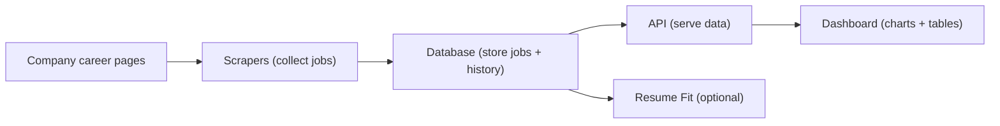
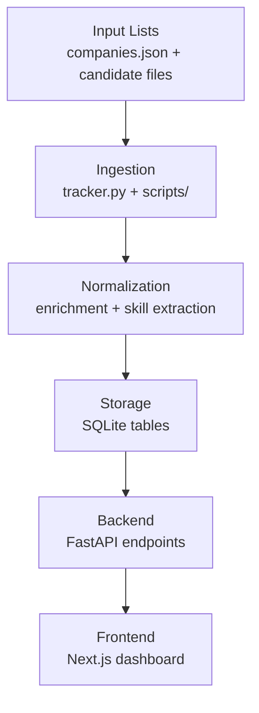
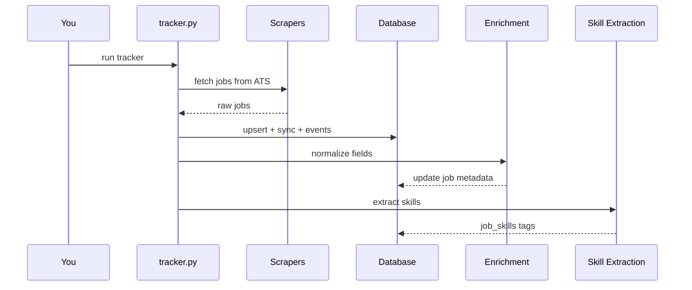
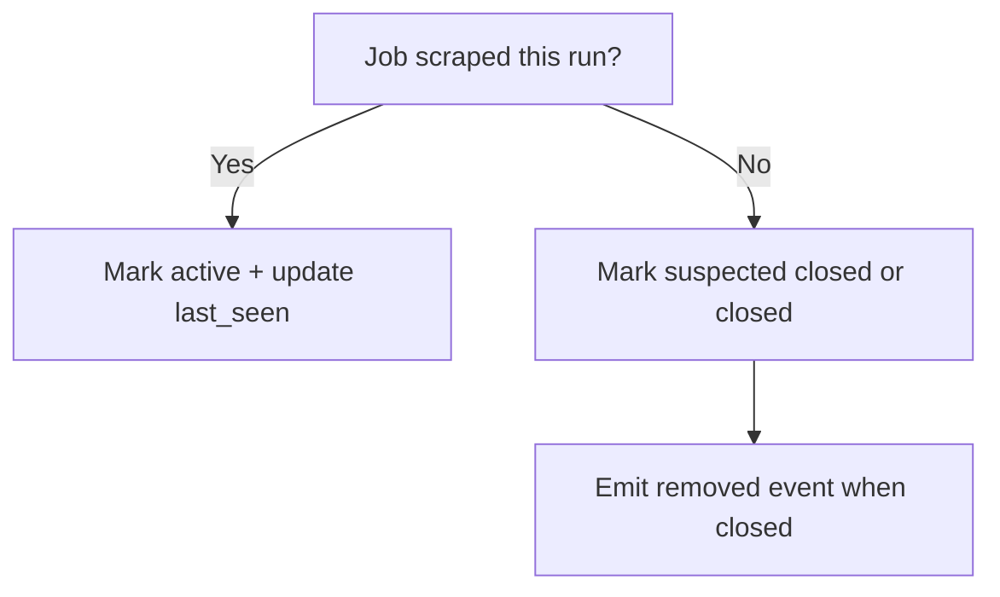
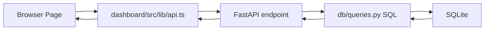
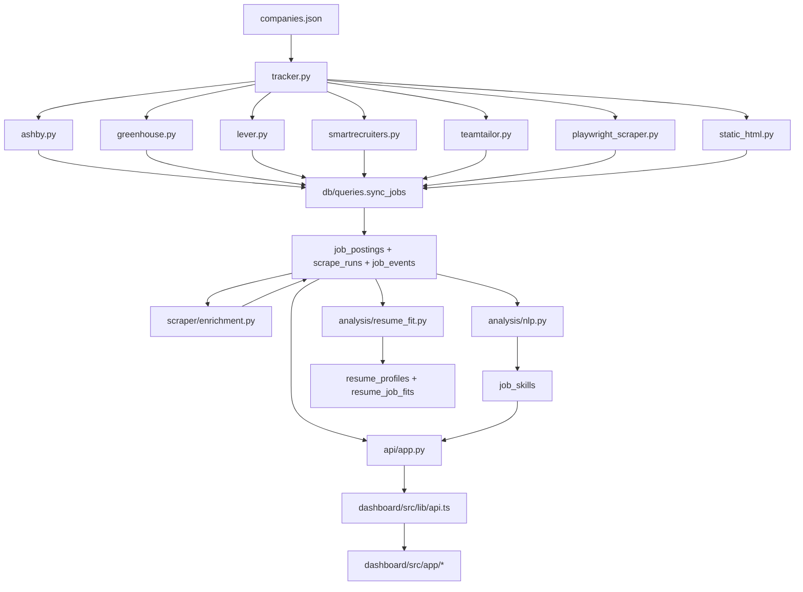

# Startup Tracker Visual Textbook (Beginner Edition)

Version: 2026-04-18  
Audience: People with little or no technical background

---

## How to Use This Book

This book is designed so you can:
1. Understand what this app does in plain English.
2. See the system visually.
3. Rebuild a working version step by step by hand.
4. Know what to do every day to operate it.

Use it like a workbook:
- Read one phase.
- Copy the commands exactly.
- Run the "Check" step before moving on.

---

## Visual Legend

- `Goal`: what this phase gives you.
- `Do This`: exact steps.
- `Check`: how to confirm you did it right.
- `If Stuck`: the fastest fix.

---

## Part 1: What This App Is

## 1.1 One-Sentence Summary

This app tracks job openings from many startup career pages, stores changes over time, and shows charts so you can see who is hiring, where, and for what roles.

## 1.2 Big Picture (Visual)



## 1.3 Real-World Analogy

Think of this app like a weather station:
- Scrapers = sensors collecting data.
- Database = weather archive.
- API = newsroom desk.
- Dashboard = weather map on TV.

---

## Part 2: What Each Layer Does

## 2.1 Layer Map



## 2.2 File Map (Simple)

| Folder/File | Job |
|---|---|
| `tracker.py` | Main run: scrape + sync + enrich + skills |
| `scraper/` | Website-specific collectors |
| `db/models.py` | DB connection + schema |
| `db/queries.py` | Read/write logic |
| `api/app.py` | HTTP endpoints |
| `dashboard/` | Web UI |
| `analysis/resume_fit.py` | Resume matching |
| `scripts/` | Discovery + ops utilities |

---

## Part 3: Rebuild It By Hand (Beginner Path)

This section is a **guided rebuild** of the app architecture.  
You can do this even if you are new, by following exactly.

## Phase 0: Install Tools

### Goal
Have the tools needed to run Python backend + Next.js frontend.

### Do This

Open Terminal and run:

```bash
python3 --version
node --version
npm --version
```

If missing:
- Install Python 3.11+ from [python.org](https://www.python.org/downloads/)
- Install Node LTS from [nodejs.org](https://nodejs.org/)

### Check
You should see version numbers, not "command not found".

### If Stuck
Restart Terminal after installing.

---

## Phase 1: Start Project Folder

### Goal
Create a workspace you can run locally.

### Do This

```bash
cd ~/Desktop
mkdir my-startup-tracker
cd my-startup-tracker
mkdir -p api db scraper analysis dashboard/src/app dashboard/src/lib scripts data
```

### Check

```bash
find . -maxdepth 2 -type d | sort
```

You should see the folders you created.

---

## Phase 2: Python Environment

### Goal
Install Python packages in an isolated environment.

### Do This

```bash
python3 -m venv .venv
source .venv/bin/activate
pip install --upgrade pip
pip install aiohttp fastapi uvicorn pypdf python-docx python-multipart
```

### Check

```bash
python -c "import fastapi, aiohttp; print('ok')"
```

Expected output: `ok`

---

## Phase 3: Create the Database Layer

### Goal
Create a SQLite DB with key tables.

### Do This

Create `db/models.py` (minimum starter):

```python
import sqlite3
from pathlib import Path

DB_PATH = Path("data/tracker.db")


def get_connection():
    DB_PATH.parent.mkdir(parents=True, exist_ok=True)
    conn = sqlite3.connect(DB_PATH)
    conn.row_factory = sqlite3.Row
    conn.execute("PRAGMA journal_mode=WAL")
    conn.execute("PRAGMA foreign_keys=ON")
    return conn


def init_db():
    conn = get_connection()
    with conn:
        conn.executescript(
            """
            CREATE TABLE IF NOT EXISTS companies (
                id INTEGER PRIMARY KEY AUTOINCREMENT,
                name TEXT NOT NULL UNIQUE,
                ats_type TEXT NOT NULL,
                ats_identifier TEXT,
                sector TEXT,
                company_type TEXT DEFAULT 'startup'
            );

            CREATE TABLE IF NOT EXISTS job_postings (
                id INTEGER PRIMARY KEY AUTOINCREMENT,
                company_id INTEGER NOT NULL REFERENCES companies(id),
                title TEXT NOT NULL,
                location TEXT,
                department TEXT,
                url TEXT,
                external_id TEXT,
                first_seen_at DATETIME DEFAULT (datetime('now')),
                last_seen_at DATETIME DEFAULT (datetime('now')),
                is_active BOOLEAN DEFAULT 1
            );

            CREATE TABLE IF NOT EXISTS scrape_runs (
                id INTEGER PRIMARY KEY AUTOINCREMENT,
                company_id INTEGER NOT NULL REFERENCES companies(id),
                run_at DATETIME DEFAULT (datetime('now')),
                jobs_found INTEGER DEFAULT 0,
                jobs_added INTEGER DEFAULT 0,
                jobs_removed INTEGER DEFAULT 0,
                status TEXT DEFAULT 'success'
            );

            CREATE TABLE IF NOT EXISTS job_events (
                id INTEGER PRIMARY KEY AUTOINCREMENT,
                job_id INTEGER NOT NULL REFERENCES job_postings(id),
                run_id INTEGER NOT NULL REFERENCES scrape_runs(id),
                event_type TEXT NOT NULL,
                created_at DATETIME DEFAULT (datetime('now'))
            );
            """
        )
    conn.close()
```

### Check

```bash
python - <<'PY'
from db.models import init_db
init_db()
print('db initialized')
PY
```

---

## Phase 4: Create a Simple Scraper Contract

### Goal
Standardize job data shape.

### Do This

Create `scraper/base.py`:

```python
from dataclasses import dataclass
from typing import Optional


@dataclass
class JobPosting:
    title: str
    company: str
    external_id: Optional[str] = None
    location: Optional[str] = None
    department: Optional[str] = None
    url: Optional[str] = None

    def to_dict(self):
        return {
            "title": self.title,
            "company": self.company,
            "external_id": self.external_id,
            "location": self.location,
            "department": self.department,
            "url": self.url,
        }
```

### Why
Every scraper should return the same data format.

---

## Phase 5: Add One Working Scraper (Greenhouse)

### Goal
Collect jobs from one ATS provider end-to-end.

### Do This

Create `scraper/greenhouse.py`:

```python
import aiohttp
from scraper.base import JobPosting


async def parse(company_name: str, slug: str):
    url = f"https://boards-api.greenhouse.io/v1/boards/{slug}/jobs?content=true"
    async with aiohttp.ClientSession() as session:
        async with session.get(url, timeout=aiohttp.ClientTimeout(total=15)) as resp:
            if resp.status != 200:
                return []
            data = await resp.json()

    jobs = []
    for row in data.get("jobs") or []:
        jobs.append(
            JobPosting(
                title=row.get("title", ""),
                company=company_name,
                external_id=str(row.get("id")) if row.get("id") else None,
                location=(row.get("location") or {}).get("name"),
                department=((row.get("departments") or [{}])[0]).get("name"),
                url=row.get("absolute_url"),
            )
        )
    return [j for j in jobs if j.title]
```

### Check
You can test later from `tracker.py`.

---

## Phase 6: Add Query Functions (Write + Read)

### Goal
Store companies/jobs and read summary data.

### Do This

Create `db/queries.py`:

```python
from db.models import get_connection


def upsert_company(company: dict) -> int:
    conn = get_connection()
    with conn:
        conn.execute(
            """
            INSERT INTO companies(name, ats_type, ats_identifier, sector, company_type)
            VALUES (?, ?, ?, ?, ?)
            ON CONFLICT(name) DO UPDATE SET
              ats_type=excluded.ats_type,
              ats_identifier=excluded.ats_identifier,
              sector=excluded.sector,
              company_type=excluded.company_type
            """,
            (
                company["name"],
                company["ats_type"],
                company.get("ats_identifier"),
                company.get("sector"),
                company.get("company_type", "startup"),
            ),
        )
        row = conn.execute("SELECT id FROM companies WHERE name = ?", (company["name"],)).fetchone()
    conn.close()
    return row["id"]


def log_run(company_id: int, jobs_found: int, jobs_added: int, jobs_removed: int, status: str = "success") -> int:
    conn = get_connection()
    with conn:
        cur = conn.execute(
            """
            INSERT INTO scrape_runs(company_id, jobs_found, jobs_added, jobs_removed, status)
            VALUES (?, ?, ?, ?, ?)
            """,
            (company_id, jobs_found, jobs_added, jobs_removed, status),
        )
        run_id = cur.lastrowid
    conn.close()
    return run_id


def sync_jobs(company_id: int, run_id: int, scraped_jobs: list[dict]):
    conn = get_connection()
    existing = conn.execute(
        "SELECT id, external_id, title FROM job_postings WHERE company_id=? AND is_active=1",
        (company_id,),
    ).fetchall()

    by_ext = {r["external_id"]: r["id"] for r in existing if r["external_id"]}
    by_title = {r["title"].strip().lower(): r["id"] for r in existing}

    matched = set()
    added = 0

    with conn:
        for job in scraped_jobs:
            existing_id = None
            ext = job.get("external_id")
            if ext and ext in by_ext:
                existing_id = by_ext[ext]
            elif job.get("title", "").strip().lower() in by_title:
                existing_id = by_title[job["title"].strip().lower()]

            if existing_id:
                matched.add(existing_id)
                conn.execute(
                    "UPDATE job_postings SET last_seen_at=datetime('now'), is_active=1 WHERE id=?",
                    (existing_id,),
                )
            else:
                cur = conn.execute(
                    """
                    INSERT INTO job_postings(company_id, title, location, department, url, external_id, is_active)
                    VALUES (?, ?, ?, ?, ?, ?, 1)
                    """,
                    (
                        company_id,
                        job["title"],
                        job.get("location"),
                        job.get("department"),
                        job.get("url"),
                        job.get("external_id"),
                    ),
                )
                job_id = cur.lastrowid
                conn.execute(
                    "INSERT INTO job_events(job_id, run_id, event_type) VALUES (?, ?, 'added')",
                    (job_id, run_id),
                )
                added += 1

        removed = 0
        for row in existing:
            if row["id"] not in matched:
                conn.execute("UPDATE job_postings SET is_active=0 WHERE id=?", (row["id"],))
                conn.execute(
                    "INSERT INTO job_events(job_id, run_id, event_type) VALUES (?, ?, 'removed')",
                    (row["id"], run_id),
                )
                removed += 1

        conn.execute("UPDATE scrape_runs SET jobs_added=?, jobs_removed=? WHERE id=?", (added, removed, run_id))

    conn.close()
    return added, removed


def get_overview_stats(company_type=None):
    conn = get_connection()
    params = []
    company_where = ""
    join_where = " WHERE jp.is_active=1"

    if company_type:
        company_where = " WHERE company_type = ?"
        join_where += " AND c.company_type = ?"
        params.append(company_type)

    total_companies = conn.execute(
        f"SELECT COUNT(*) FROM companies{company_where}",
        params if company_type else (),
    ).fetchone()[0]

    total_active_jobs = conn.execute(
        f"SELECT COUNT(*) FROM job_postings jp JOIN companies c ON c.id=jp.company_id{join_where}",
        params if company_type else (),
    ).fetchone()[0]

    last_run = conn.execute("SELECT MAX(run_at) FROM scrape_runs").fetchone()[0]
    conn.close()

    return {
        "total_companies": total_companies,
        "total_active_jobs": total_active_jobs,
        "last_run": last_run,
        "net_added": 0,
        "net_removed": 0,
    }
```

---

## Phase 7: Create the Main Runner

### Goal
Run one full scrape and save data.

### Do This

Create `companies.json`:

```json
[
  {
    "name": "Stripe",
    "ats_type": "greenhouse",
    "ats_identifier": "stripe",
    "sector": "Fintech & Payments",
    "company_type": "bigco"
  }
]
```

Create `tracker.py`:

```python
import asyncio
import json
from pathlib import Path

from db.models import init_db
from db import queries
import scraper.greenhouse as greenhouse

COMPANIES_FILE = Path("companies.json")


def load_companies():
    with open(COMPANIES_FILE) as f:
        return json.load(f)


async def run():
    init_db()
    companies = load_companies()

    for c in companies:
        company_id = queries.upsert_company(c)
        jobs = await greenhouse.parse(c["name"], c["ats_identifier"])
        run_id = queries.log_run(company_id, len(jobs), 0, 0)
        added, removed = queries.sync_jobs(company_id, run_id, [j.to_dict() for j in jobs])
        print(f"{c['name']}: found={len(jobs)} added={added} removed={removed}")


if __name__ == "__main__":
    asyncio.run(run())
```

### Check

```bash
python tracker.py
```

You should see one line of results with found/added/removed counts.

---

## Phase 8: Add the API

### Goal
Make your data available to a web app.

### Do This

Create `api/app.py`:

```python
from fastapi import FastAPI
from typing import Optional

from db.models import init_db
from db import queries

app = FastAPI(title="Startup Tracker API")
init_db()


@app.get("/api/overview")
def overview(company_type: Optional[str] = None):
    return queries.get_overview_stats(company_type=company_type)
```

Run API:

```bash
uvicorn api.app:app --reload --port 8000
```

### Check
Open in browser:

[http://localhost:8000/api/overview](http://localhost:8000/api/overview)

You should see JSON.

---

## Phase 9: Add a Very Simple Dashboard

### Goal
Show data in a browser UI.

### Do This

```bash
cd dashboard
npm init -y
npm install next react react-dom
npm install -D typescript @types/react @types/react-dom @types/node
npx next@latest telemetry disable
```

Create `dashboard/package.json` scripts (edit):

```json
{
  "scripts": {
    "dev": "next dev",
    "build": "next build",
    "start": "next start"
  }
}
```

Create `dashboard/src/app/page.tsx`:

```tsx
"use client";

import { useEffect, useState } from "react";

export default function Page() {
  const [data, setData] = useState<any>(null);

  useEffect(() => {
    fetch("http://localhost:8000/api/overview")
      .then((r) => r.json())
      .then(setData);
  }, []);

  return (
    <main style={{ padding: 24, fontFamily: "sans-serif" }}>
      <h1>Startup Tracker</h1>
      {!data ? (
        <p>Loading...</p>
      ) : (
        <div>
          <p>Total companies: {data.total_companies}</p>
          <p>Total active jobs: {data.total_active_jobs}</p>
          <p>Last run: {data.last_run || "Never"}</p>
        </div>
      )}
    </main>
  );
}
```

Start frontend:

```bash
npm run dev
```

### Check
Open [http://localhost:3000](http://localhost:3000)

---

## Phase 10: Expand to Full App (This Repo)

Now map your mini version to the full production-style version:

| Mini Build | Full Repo Equivalent |
|---|---|
| one scraper | many scrapers in `scraper/*.py` |
| one endpoint | many in `api/app.py` |
| one page | many in `dashboard/src/app/*` |
| simple sync | advanced lifecycle sync in `db/queries.py` |
| no enrichment | enrichment + skill extraction pipeline |

---

## Part 4: Visual Flows You Should Understand

## 4.1 Daily Run Timeline



## 4.2 Job Open/Close Logic



## 4.3 API-to-UI Flow



---

## Part 5: Plain-English Explanation of Key Features

## 5.1 Overview Page

Shows:
- How many companies are tracked.
- How many jobs are active.
- What changed recently.

## 5.2 Companies Page

Shows each company with:
- active job count,
- sector,
- funding stage,
- change velocity.

## 5.3 Changes Page

Shows timeline of openings/closures.  
This is powered by `job_events`.

## 5.4 Jobs Page

Search and filter jobs by:
- sector,
- skills,
- department,
- work model,
- company type.

## 5.5 Resume Fit (Optional)

Upload resume, get:
- best matching jobs,
- score,
- strengths/gaps pointers.

---

## Part 6: Scripts Explained Like a Playbook

| Script | Use It When | Input | Output |
|---|---|---|---|
| `scripts/batch_discover.py` | You have new company names to test | txt names | JSON ATS hits |
| `scripts/import_bulk_hits.py` | You want to add discovered hits to DB | hits JSON | new companies in DB |
| `scripts/growth_run.py` | You want one-command growth cycle | candidate files | discovery + import + scrape + maintenance |
| `scripts/growth_maintenance.py` | You want to apply quality tags | DB state | tag updates |
| `scripts/make_demo_db.py` | You need lightweight demo DB | existing DB | trimmed demo DB |

---

## Part 7: Daily Operations (Beginner Checklist)

## 7.1 Morning Checklist

1. Start API.
2. Start dashboard.
3. Run tracker.
4. Open Health page.
5. Confirm no major scraper failures.

Commands:

```bash
source .venv/bin/activate
python tracker.py
uvicorn api.app:app --reload --port 8000
```

New terminal:

```bash
cd dashboard
npm run dev
```

## 7.2 Weekly Checklist

1. Run growth discovery scripts.
2. Import valid hits.
3. Re-run tracker.
4. Check Trends and Changes pages.

---

## Part 8: Troubleshooting (Very Practical)

## 8.1 "API not loading"

- Make sure backend is running on port 8000.
- Open [http://localhost:8000/api/overview](http://localhost:8000/api/overview)
- If it fails, check terminal error and restart.

## 8.2 "Dashboard shows blank"

- Confirm frontend is running on port 3000.
- Confirm `NEXT_PUBLIC_API_URL` points to backend if not localhost.

## 8.3 "No jobs found"

- ATS slug may be wrong.
- Test with known slug in Greenhouse first.
- Confirm internet access.

## 8.4 "Build/type errors"

In the current repo state, some newer pages (`analyst`, `radar`) are ahead of API typings/endpoints and may fail full build until backend/type contracts are aligned.

---

## Part 9: Why the Design Looks Like This

## 9.1 Why SQLite first

- Easy local setup.
- Great for analytics prototyping.
- No server admin needed.

## 9.2 Why many small scraper files

- Each ATS changes independently.
- Easier debugging and safer updates.

## 9.3 Why event log + active table

- Active table gives fast current views.
- Event log gives accurate history and trend charts.

## 9.4 Why deterministic score + LLM fit

- Deterministic score gives stable ranking.
- LLM adds human-readable advice.

---

## Part 10: Full-App Visual Blueprint (Reference)



---

## Part 11: "Copy This" Commands for This Existing Repo

If you want to run the full repo as-is:

```bash
cd /Users/imanbaghai/Desktop/startup-tracker
python3 -m venv .venv
source .venv/bin/activate
pip install -r requirements.txt
python tracker.py
uvicorn api.app:app --reload --port 8000
```

New terminal:

```bash
cd /Users/imanbaghai/Desktop/startup-tracker/dashboard
npm install
npm run dev
```

Then open:
- API: [http://localhost:8000/api/overview](http://localhost:8000/api/overview)
- Dashboard: [http://localhost:3000](http://localhost:3000)

---

## Part 12: Beginner Success Milestones

You are done with this textbook when you can:
1. Explain the 5 layers (scrape, store, serve, visualize, analyze).
2. Run `tracker.py` and see job counts update.
3. Open `/api/overview` and understand the JSON.
4. Open dashboard and explain each major page.
5. Add one new company and see it appear after a run.

---

## Part 13: Next Step Paths

Choose one learning path:

### Path A (Operator)
- Focus on daily runs, health checks, and growth scripts.

### Path B (Analyst)
- Focus on trends, changes, and cohort analysis.

### Path C (Builder)
- Add one new scraper adapter.
- Add one new API endpoint.
- Add one new dashboard chart.

---

## Appendix: Current Repo Reality Notes

These are practical notes about the current state of this repository:
- The core scrape -> DB -> API -> dashboard flow is solid.
- Some newer frontend pages (`analyst`, `radar`) are ahead of the exported API types/endpoints and may fail full production build until contracts are aligned.
- Some growth/discovery scripts reference functions not present in the current `db/queries.py` file.

This does not block learning the architecture or running the core pipeline.

