# Startup Tracker Complete Book

This single book combines both learning paths into one document.

- Section 1: Tutorial Workbook (beginner-friendly build path)
- Section 2: Project Atlas (deep walkthrough of the current repository)

---

## Table of Contents

1. Section 1: Tutorial Workbook
2. Section 2: Current Project Atlas

---

## Section 1: Tutorial Workbook


Audience: beginner to low-technical background  
Goal: rebuild a working version by hand, while learning why each part exists

---

## How to use this workbook

This workbook is designed as a mission path.

- Read one mission at a time.
- Copy code exactly.
- Run the checkpoint command before moving on.
- If a checkpoint fails, use the "If stuck" box in that mission.

Learning rhythm:

1. Build a small piece.
2. See it working.
3. Understand it visually.
4. Continue.

---

## Mission Map

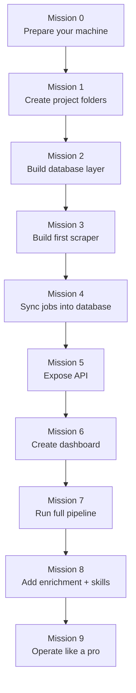

Progress board:

- [ ] Mission 0 complete
- [ ] Mission 1 complete
- [ ] Mission 2 complete
- [ ] Mission 3 complete
- [ ] Mission 4 complete
- [ ] Mission 5 complete
- [ ] Mission 6 complete
- [ ] Mission 7 complete
- [ ] Mission 8 complete
- [ ] Mission 9 complete

---

## Mission 0: Prepare your machine

### Goal
Install and verify required tools.

### Run

```bash
python3 --version
node --version
npm --version
```

### Expected
You should see version numbers, not "command not found".

### If stuck

- Install Python from [python.org](https://www.python.org/downloads/)
- Install Node LTS from [nodejs.org](https://nodejs.org/)
- Restart terminal and run checks again

---

## Mission 1: Create your project workspace

### Goal
Create the same layer structure used by the real app.

### Run

```bash
cd ~/Desktop
mkdir startup-tracker-learning
cd startup-tracker-learning
mkdir -p api db scraper analysis dashboard/src/app dashboard/src/lib scripts data
```

### Visual

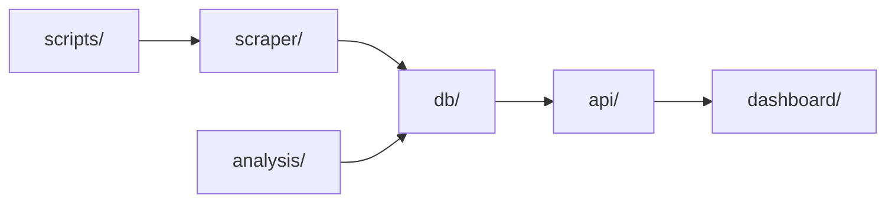

### Check

```bash
find . -maxdepth 2 -type d | sort
```

---

## Mission 2: Build the database foundation

### Goal
Create a SQLite database with core tables.

Create file: `db/models.py`

```python
# Import sqlite so we can talk to a local database file.
import sqlite3

# Import Path so file paths work consistently on any OS.
from pathlib import Path

# Define where the DB file will live.
DB_PATH = Path("data/tracker.db")


def get_connection():
    # Ensure the parent folder exists before opening DB.
    DB_PATH.parent.mkdir(parents=True, exist_ok=True)

    # Open a SQLite connection to our DB file.
    conn = sqlite3.connect(DB_PATH)

    # Make rows behave like dictionaries (row["column_name"]).
    conn.row_factory = sqlite3.Row

    # Enable WAL mode for better read/write concurrency.
    conn.execute("PRAGMA journal_mode=WAL")

    # Enforce foreign key constraints.
    conn.execute("PRAGMA foreign_keys=ON")

    # Return the ready-to-use DB connection.
    return conn


def init_db():
    # Open connection.
    conn = get_connection()

    # Use transaction block for schema creation.
    with conn:
        # Create core tables if they do not exist.
        conn.executescript(
            """
            CREATE TABLE IF NOT EXISTS companies (
                id INTEGER PRIMARY KEY AUTOINCREMENT,
                name TEXT NOT NULL UNIQUE,
                ats_type TEXT NOT NULL,
                ats_identifier TEXT,
                sector TEXT,
                company_type TEXT DEFAULT 'startup'
            );

            CREATE TABLE IF NOT EXISTS job_postings (
                id INTEGER PRIMARY KEY AUTOINCREMENT,
                company_id INTEGER NOT NULL REFERENCES companies(id),
                title TEXT NOT NULL,
                location TEXT,
                department TEXT,
                url TEXT,
                external_id TEXT,
                first_seen_at DATETIME DEFAULT (datetime('now')),
                last_seen_at DATETIME DEFAULT (datetime('now')),
                posting_status TEXT DEFAULT 'active',
                is_active BOOLEAN DEFAULT 1
            );

            CREATE TABLE IF NOT EXISTS scrape_runs (
                id INTEGER PRIMARY KEY AUTOINCREMENT,
                company_id INTEGER NOT NULL REFERENCES companies(id),
                run_at DATETIME DEFAULT (datetime('now')),
                jobs_found INTEGER DEFAULT 0,
                jobs_added INTEGER DEFAULT 0,
                jobs_removed INTEGER DEFAULT 0,
                status TEXT DEFAULT 'success'
            );

            CREATE TABLE IF NOT EXISTS job_events (
                id INTEGER PRIMARY KEY AUTOINCREMENT,
                job_id INTEGER NOT NULL REFERENCES job_postings(id),
                run_id INTEGER NOT NULL REFERENCES scrape_runs(id),
                event_type TEXT NOT NULL,
                created_at DATETIME DEFAULT (datetime('now'))
            );
            """
        )

    # Close connection.
    conn.close()
```

### Check

```bash
python3 - <<'PY'
from db.models import init_db
init_db()
print('DB created')
PY
```

### Visual: table relationships

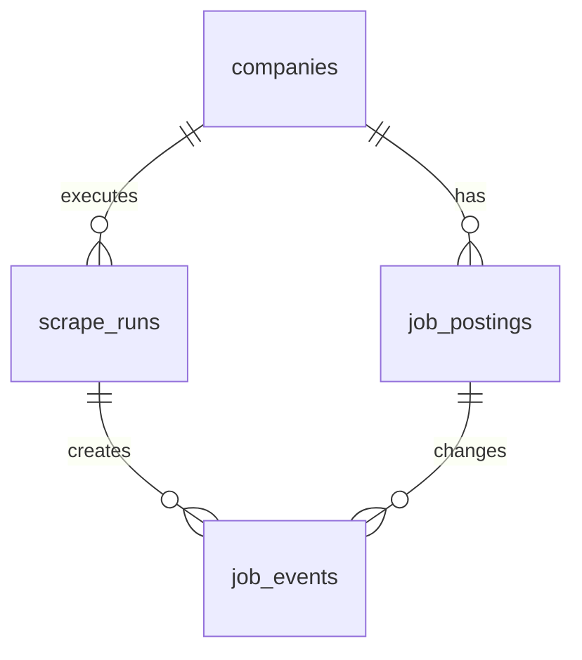

---

## Mission 3: Build your first scraper

### Goal
Collect jobs from Greenhouse and normalize fields.

Create file: `scraper/base.py`

```python
# Import dataclass to define clean structured data objects.
from dataclasses import dataclass

# Import Optional for fields that may be empty.
from typing import Optional


@dataclass
class JobPosting:
    # Required fields.
    title: str
    company: str

    # Optional fields from ATS providers.
    external_id: Optional[str] = None
    location: Optional[str] = None
    department: Optional[str] = None
    url: Optional[str] = None

    def to_dict(self):
        # Convert dataclass to plain dict for DB writing.
        return {
            "title": self.title,
            "company": self.company,
            "external_id": self.external_id,
            "location": self.location,
            "department": self.department,
            "url": self.url,
        }
```

Create file: `scraper/greenhouse.py`

```python
# aiohttp lets us call APIs asynchronously.
import aiohttp

# Import the shared normalized job model.
from scraper.base import JobPosting


async def parse(company_name: str, slug: str):
    # Build Greenhouse API URL for this company slug.
    url = f"https://boards-api.greenhouse.io/v1/boards/{slug}/jobs?content=true"

    # Open network session.
    async with aiohttp.ClientSession() as session:
        # Call API with timeout.
        async with session.get(url, timeout=aiohttp.ClientTimeout(total=15)) as resp:
            # If not successful, return empty list.
            if resp.status != 200:
                return []

            # Parse JSON body.
            data = await resp.json()

    # Build normalized job list.
    jobs = []

    # Iterate each job in API response.
    for row in data.get("jobs") or []:
        jobs.append(
            JobPosting(
                # Job title.
                title=row.get("title", ""),
                # Company display name.
                company=company_name,
                # Stable ATS job ID.
                external_id=str(row.get("id")) if row.get("id") else None,
                # Human readable location.
                location=(row.get("location") or {}).get("name"),
                # First department if present.
                department=((row.get("departments") or [{}])[0]).get("name"),
                # Public application URL.
                url=row.get("absolute_url"),
            )
        )

    # Return only jobs that have a title.
    return [j for j in jobs if j.title]
```

### Check

```bash
python3 - <<'PY'
import asyncio
from scraper.greenhouse import parse

async def main():
    rows = await parse('Stripe', 'stripe')
    print('jobs fetched:', len(rows))
    if rows:
        print('example title:', rows[0].title)

asyncio.run(main())
PY
```

---

## Mission 4: Sync jobs into database

### Goal
Insert new jobs, keep existing jobs updated, close missing jobs.

Create file: `db/queries.py`

```python
# Import DB connection factory.
from db.models import get_connection


def upsert_company(company: dict) -> int:
    # Open DB connection.
    conn = get_connection()

    # Run write transaction.
    with conn:
        # Insert company, or update key metadata on name conflict.
        conn.execute(
            """
            INSERT INTO companies(name, ats_type, ats_identifier, sector, company_type)
            VALUES (?, ?, ?, ?, ?)
            ON CONFLICT(name) DO UPDATE SET
                ats_type=excluded.ats_type,
                ats_identifier=excluded.ats_identifier,
                sector=excluded.sector,
                company_type=excluded.company_type
            """,
            (
                company["name"],
                company["ats_type"],
                company.get("ats_identifier"),
                company.get("sector"),
                company.get("company_type", "startup"),
            ),
        )

        # Read final company id.
        row = conn.execute(
            "SELECT id FROM companies WHERE name = ?",
            (company["name"],),
        ).fetchone()

    # Close connection.
    conn.close()

    # Return id as integer.
    return row["id"]


def log_run(company_id: int, jobs_found: int, jobs_added: int, jobs_removed: int, status: str = "success") -> int:
    # Open DB connection.
    conn = get_connection()

    # Insert scrape run row.
    with conn:
        cur = conn.execute(
            """
            INSERT INTO scrape_runs(company_id, jobs_found, jobs_added, jobs_removed, status)
            VALUES (?, ?, ?, ?, ?)
            """,
            (company_id, jobs_found, jobs_added, jobs_removed, status),
        )

        # Capture run id for linking events.
        run_id = cur.lastrowid

    # Close connection.
    conn.close()

    # Return run id.
    return run_id


def sync_jobs(company_id: int, run_id: int, scraped_jobs: list[dict]):
    # Open DB connection.
    conn = get_connection()

    # Pull currently active jobs for this company.
    existing = conn.execute(
        """
        SELECT id, external_id, title
        FROM job_postings
        WHERE company_id = ? AND is_active = 1
        """,
        (company_id,),
    ).fetchall()

    # Build quick lookup maps.
    by_external_id = {r["external_id"]: r["id"] for r in existing if r["external_id"]}
    by_title = {r["title"].strip().lower(): r["id"] for r in existing if r["title"]}

    # Keep track of records we matched this run.
    matched_ids = set()

    # Count newly added jobs.
    added = 0

    with conn:
        # Process every scraped job.
        for job in scraped_jobs:
            existing_id = None

            # Try best match by external id.
            ext_id = job.get("external_id")
            if ext_id and ext_id in by_external_id:
                existing_id = by_external_id[ext_id]

            # Fallback match by normalized title.
            if not existing_id:
                title_key = job.get("title", "").strip().lower()
                if title_key in by_title:
                    existing_id = by_title[title_key]

            if existing_id:
                # Mark as seen and keep active.
                matched_ids.add(existing_id)
                conn.execute(
                    """
                    UPDATE job_postings
                    SET last_seen_at = datetime('now'), posting_status='active', is_active=1
                    WHERE id = ?
                    """,
                    (existing_id,),
                )
            else:
                # Insert brand new job.
                cur = conn.execute(
                    """
                    INSERT INTO job_postings(
                        company_id, title, location, department, url, external_id,
                        posting_status, is_active
                    )
                    VALUES (?, ?, ?, ?, ?, ?, 'active', 1)
                    """,
                    (
                        company_id,
                        job.get("title"),
                        job.get("location"),
                        job.get("department"),
                        job.get("url"),
                        job.get("external_id"),
                    ),
                )

                # New inserted id.
                new_job_id = cur.lastrowid

                # Log add event.
                conn.execute(
                    "INSERT INTO job_events(job_id, run_id, event_type) VALUES (?, ?, 'added')",
                    (new_job_id, run_id),
                )

                # Increase add counter.
                added += 1

        # Detect jobs that disappeared this run.
        removed = 0
        for row in existing:
            if row["id"] not in matched_ids:
                # Mark missing jobs as closed.
                conn.execute(
                    """
                    UPDATE job_postings
                    SET is_active = 0, posting_status='closed'
                    WHERE id = ?
                    """,
                    (row["id"],),
                )

                # Log remove event.
                conn.execute(
                    "INSERT INTO job_events(job_id, run_id, event_type) VALUES (?, ?, 'removed')",
                    (row["id"], run_id),
                )

                # Increase remove counter.
                removed += 1

        # Update run metrics with final counts.
        conn.execute(
            "UPDATE scrape_runs SET jobs_added=?, jobs_removed=? WHERE id=?",
            (added, removed, run_id),
        )

    # Close connection.
    conn.close()

    # Return summary tuple.
    return added, removed


def get_overview_stats(company_type=None):
    # Open connection.
    conn = get_connection()

    # Count companies (optionally scoped by type).
    if company_type:
        total_companies = conn.execute(
            "SELECT COUNT(*) FROM companies WHERE company_type = ?",
            (company_type,),
        ).fetchone()[0]
    else:
        total_companies = conn.execute("SELECT COUNT(*) FROM companies").fetchone()[0]

    # Count active jobs (optionally scoped by company type).
    if company_type:
        total_active_jobs = conn.execute(
            """
            SELECT COUNT(*)
            FROM job_postings jp
            JOIN companies c ON c.id = jp.company_id
            WHERE jp.is_active = 1 AND c.company_type = ?
            """,
            (company_type,),
        ).fetchone()[0]
    else:
        total_active_jobs = conn.execute(
            "SELECT COUNT(*) FROM job_postings WHERE is_active = 1"
        ).fetchone()[0]

    # Last successful run timestamp.
    last_run = conn.execute("SELECT MAX(run_at) FROM scrape_runs").fetchone()[0]

    # Close connection.
    conn.close()

    # Return dashboard-friendly shape.
    return {
        "total_companies": total_companies,
        "total_active_jobs": total_active_jobs,
        "last_run": last_run,
        "net_added": 0,
        "net_removed": 0,
    }
```

### Visual: sync logic

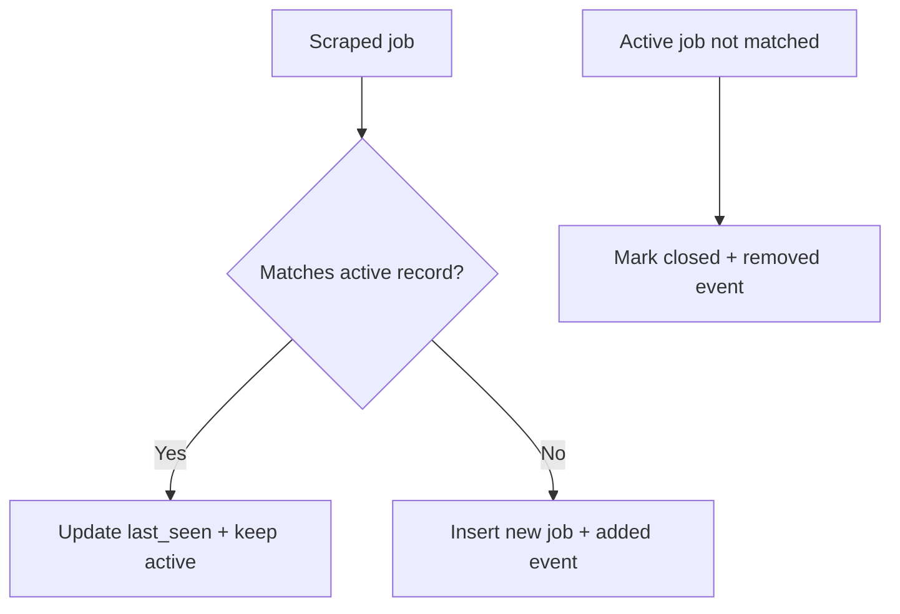

---

## Mission 5: Build the orchestrator

### Goal
Run one command to scrape and sync all tracked companies.

Create file: `companies.json`

```json
[
  {
    "name": "Stripe",
    "ats_type": "greenhouse",
    "ats_identifier": "stripe",
    "sector": "Fintech & Payments",
    "company_type": "bigco"
  },
  {
    "name": "Notion",
    "ats_type": "greenhouse",
    "ats_identifier": "notion",
    "sector": "Enterprise Software",
    "company_type": "startup"
  }
]
```

Create file: `tracker.py`

```python
# asyncio is used to run async scraper functions.
import asyncio

# json loads the companies config file.
import json

# Path gives stable file handling.
from pathlib import Path

# Initialize database schema.
from db.models import init_db

# Query helpers for company upsert + job sync.
from db import queries

# Greenhouse scraper module.
import scraper.greenhouse as greenhouse_scraper

# Companies source file path.
COMPANIES_FILE = Path("companies.json")


def load_companies() -> list:
    # Open and parse JSON config.
    with open(COMPANIES_FILE) as f:
        return json.load(f)


async def scrape_company(company: dict, company_id: int):
    # Read key company fields.
    name = company["name"]
    ats_type = company["ats_type"]

    # Support Greenhouse in this tutorial build.
    if ats_type == "greenhouse":
        jobs = await greenhouse_scraper.parse(name, company["ats_identifier"])
    else:
        # Unknown ATS in this tutorial path.
        jobs = []

    # Convert JobPosting objects to dictionaries.
    job_dicts = [j.to_dict() for j in jobs]

    # Create run row with placeholder add/remove counts.
    run_id = queries.log_run(company_id, len(jobs), 0, 0, status="success")

    # Sync canonical job state.
    added, removed = queries.sync_jobs(company_id, run_id, job_dicts)

    # Return summary.
    return len(jobs), added, removed


async def run():
    # Ensure DB schema exists.
    init_db()

    # Load company list.
    companies = load_companies()

    # Map company names to DB ids.
    company_ids = {}
    for c in companies:
        company_ids[c["name"]] = queries.upsert_company(c)

    # Process all companies one-by-one for beginner clarity.
    for c in companies:
        found, added, removed = await scrape_company(c, company_ids[c["name"]])
        print(f"{c['name']}: found={found} added={added} removed={removed}")


if __name__ == "__main__":
    # Entry point.
    asyncio.run(run())
```

### Check

```bash
python3 tracker.py
```

---

## Mission 6: Build API layer

### Goal
Expose data to frontend.

Create file: `api/app.py`

```python
# FastAPI framework.
from fastapi import FastAPI

# Optional type for query params.
from typing import Optional

# Ensure database exists at API startup.
from db.models import init_db

# Query layer for reading stats.
from db import queries

# Create web app instance.
app = FastAPI(title="Startup Tracker API")

# Initialize DB schema now.
init_db()


@app.get("/api/overview")
def overview(company_type: Optional[str] = None):
    # Return high-level totals for dashboard cards.
    return queries.get_overview_stats(company_type=company_type)
```

### Check

```bash
uvicorn api.app:app --reload --port 8000
```

Open [http://localhost:8000/api/overview](http://localhost:8000/api/overview)

---

## Mission 7: Build dashboard layer

### Goal
Show API data in a browser page.

Inside `dashboard/` run:

```bash
npm init -y
npm install next react react-dom
npm install -D typescript @types/react @types/react-dom @types/node
```

Create file: `dashboard/package.json` (replace scripts section):

```json
{
  "name": "dashboard",
  "private": true,
  "scripts": {
    "dev": "next dev",
    "build": "next build",
    "start": "next start"
  }
}
```

Create file: `dashboard/src/app/page.tsx`

```tsx
"use client";

// React hooks for state and lifecycle.
import { useEffect, useState } from "react";

export default function Page() {
  // Hold API response.
  const [data, setData] = useState<any>(null);

  // Fetch once after component mounts.
  useEffect(() => {
    fetch("http://localhost:8000/api/overview")
      .then((r) => r.json())
      .then(setData)
      .catch(() => setData({ error: true }));
  }, []);

  return (
    <main style={{ padding: 24, fontFamily: "sans-serif", maxWidth: 900, margin: "0 auto" }}>
      <h1>Startup Tracker</h1>
      <p style={{ color: "#555" }}>Tutorial dashboard</p>

      {!data ? (
        <p>Loading...</p>
      ) : data.error ? (
        <p>Could not load API data.</p>
      ) : (
        <section style={{ border: "1px solid #ddd", borderRadius: 8, padding: 16 }}>
          <p>Total companies: {data.total_companies}</p>
          <p>Total active jobs: {data.total_active_jobs}</p>
          <p>Last run: {data.last_run || "Never"}</p>
        </section>
      )}
    </main>
  );
}
```

### Check

```bash
cd dashboard
npm run dev
```

Open [http://localhost:3000](http://localhost:3000)

---

## Mission 8: Add simple enrichment + skill extraction

### Goal
Turn raw text into useful analytics dimensions.

Create file: `scraper/enrichment.py`

```python
# Import DB connection.
from db.models import get_connection


def enrich_all():
    # Open connection.
    conn = get_connection()

    # Get jobs missing basic normalized fields.
    rows = conn.execute(
        """
        SELECT id, title, location, department
        FROM job_postings
        WHERE posting_status IS NULL OR department IS NULL
        """
    ).fetchall()

    if not rows:
        conn.close()
        return 0

    with conn:
        for r in rows:
            # Fallback department if missing.
            department = r["department"] or "Other"

            # Ensure status default.
            status = "active"

            # Update row.
            conn.execute(
                """
                UPDATE job_postings
                SET department = ?, posting_status = ?
                WHERE id = ?
                """,
                (department, status, r["id"]),
            )

    count = len(rows)
    conn.close()
    return count
```

Create file: `analysis/nlp.py`

```python
# Regex engine.
import re

# DB connection.
from db.models import get_connection

# Tiny starter dictionary.
SKILLS = {
    "Python": re.compile(r"\\bPython\\b", re.I),
    "SQL": re.compile(r"\\bSQL\\b", re.I),
    "React": re.compile(r"\\bReact\\b", re.I),
}


def extract_skills(text: str):
    # Return matched canonical skill names.
    if not text:
        return []
    found = []
    for name, pattern in SKILLS.items():
        if pattern.search(text):
            found.append(name)
    return found


def extract_all_skills():
    # Open connection.
    conn = get_connection()

    # Ensure table exists.
    with conn:
        conn.execute(
            """
            CREATE TABLE IF NOT EXISTS job_skills (
                job_id INTEGER NOT NULL REFERENCES job_postings(id),
                skill TEXT NOT NULL,
                PRIMARY KEY(job_id, skill)
            )
            """
        )

    # Read jobs.
    rows = conn.execute("SELECT id, title FROM job_postings").fetchall()

    total = 0
    with conn:
        for r in rows:
            # Use title as text source in this mini tutorial.
            skills = extract_skills(r["title"])
            for s in skills:
                conn.execute(
                    "INSERT OR IGNORE INTO job_skills(job_id, skill) VALUES (?, ?)",
                    (r["id"], s),
                )
                total += 1

    conn.close()
    return total
```

---

## Mission 9: Run and operate

### Goal
Run the complete mini pipeline in the correct order.

### Run order

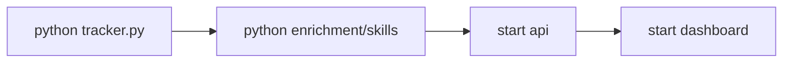

### Commands

Terminal 1:

```bash
cd ~/Desktop/startup-tracker-learning
source .venv/bin/activate
python3 tracker.py
python3 - <<'PY'
from scraper.enrichment import enrich_all
from analysis.nlp import extract_all_skills
print('enriched:', enrich_all())
print('skills:', extract_all_skills())
PY
uvicorn api.app:app --reload --port 8000
```

Terminal 2:

```bash
cd ~/Desktop/startup-tracker-learning/dashboard
npm run dev
```

---

## Quick visual recap

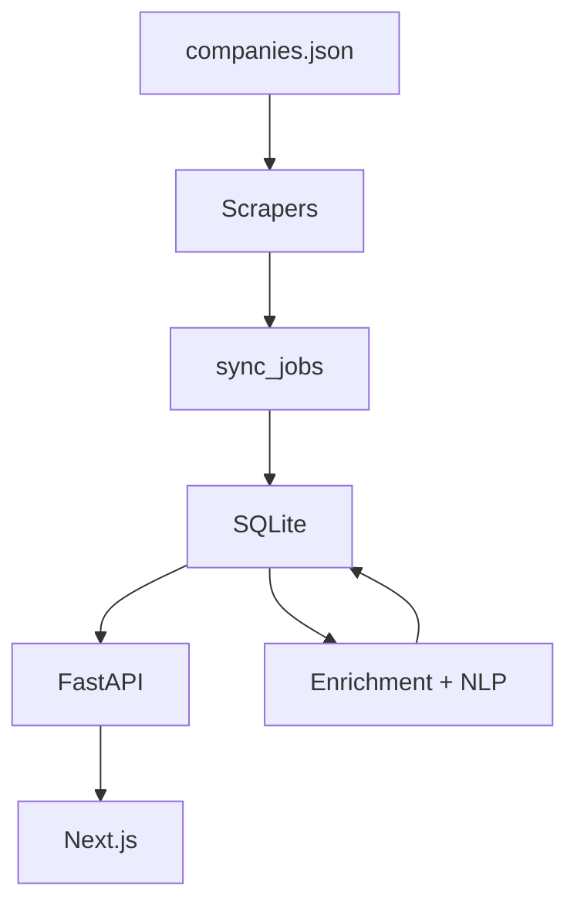

---

## Beginner troubleshooting tree

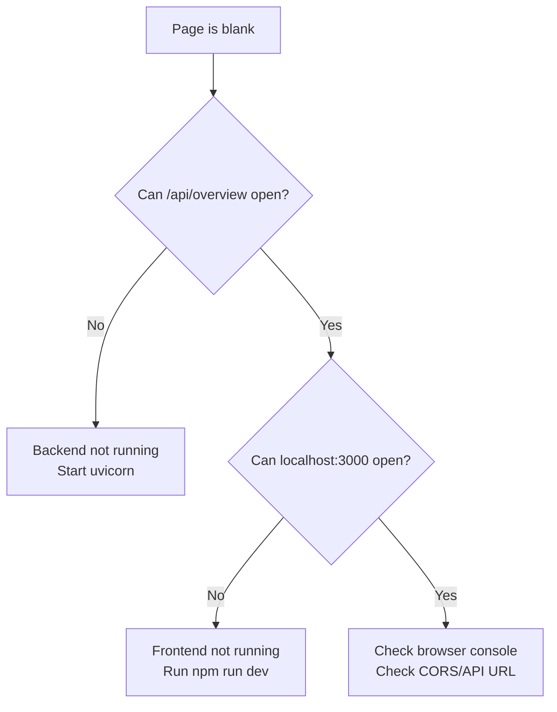

---

## What to learn next

1. Add more scrapers (`ashby`, `lever`, `smartrecruiters`).
2. Add richer lifecycle logic (`suspected_closed` before hard close).
3. Add job events analytics endpoint and changes chart.
4. Add resume-fit endpoint and upload UI.

---

## Appendix A: How this tutorial maps to the real repo

| Tutorial Component | Real Project Component |
|---|---|
| minimal `db/models.py` | full schema + migration-safe alters |
| one scraper | many ATS modules in `scraper/` |
| simple `sync_jobs` | robust identity + lifecycle + event logic |
| one overview endpoint | full API surface in `api/app.py` |
| one dashboard page | many pages in `dashboard/src/app/*` |


---

## Section 2: Current Project Atlas


Audience: builders and operators  
Purpose: understand the exact current project architecture and code flow end-to-end

---

## How this book is organized

This book has two parallel tracks:

- Track A (Visual): architecture diagrams and flow maps.
- Track B (Code Lens): annotated code walkthroughs with line-by-line intent.

Use both together.

---

## Section 1: Whole-system visual model

## 1.1 Current production architecture

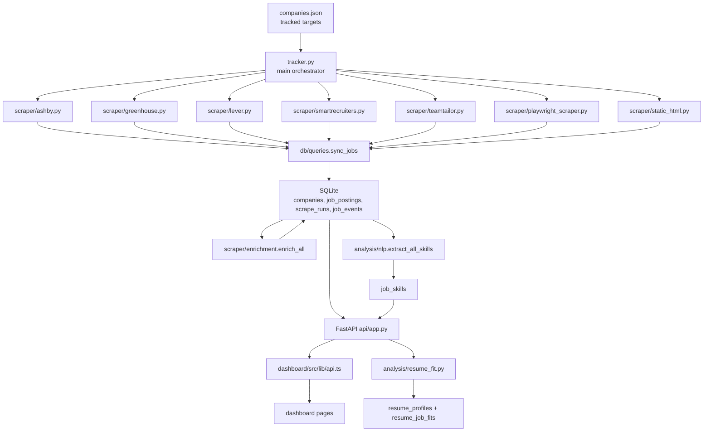

## 1.2 Data lifecycle timeline

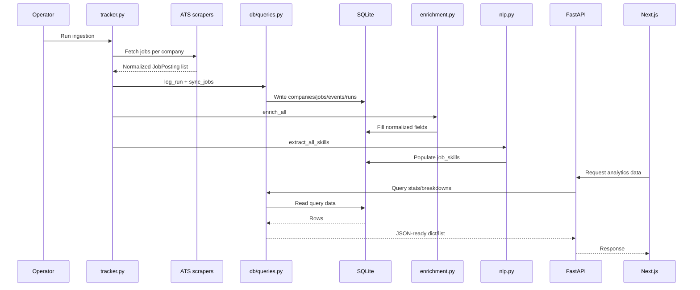

---

## Section 2: Repository inventory

## 2.1 Top-level map

| Path | Role |
|---|---|
| `tracker.py` | ingestion orchestrator |
| `api/app.py` | REST API surface |
| `db/models.py` | DB connection + schema init |
| `db/queries.py` | write/read query logic |
| `scraper/` | ATS parsers + enrichment |
| `analysis/` | skill extraction + resume fit |
| `dashboard/` | Next.js frontend |
| `dashboard.py` | legacy Streamlit dashboard |
| `scripts/` | discovery/growth/migration utilities |
| `DEPLOY.md` | deployment instructions |
| `Procfile` | backend process command |

## 2.2 Runtime dependencies

From `requirements.txt` and `dashboard/package.json`:

- Python stack: `aiohttp`, `fastapi`, `uvicorn`, `playwright`, `pypdf`, `python-docx`, `streamlit`, `pandas`, `altair`.
- Frontend stack: `next@16`, `react@19`, `recharts`, `lucide-react`, `tailwindcss`.

---

## Section 3: Database and schema internals

## 3.1 `db/models.py` intent

Primary responsibilities:

1. Resolve DB path (`TRACKER_DB_PATH` override).
2. Open sqlite connection with WAL + FK enabled.
3. Create base schema and additive index/column migrations.

## 3.2 Annotated code lens: `get_connection` and `init_db`

```python
# db/models.py (conceptual annotated lens)

def get_connection() -> sqlite3.Connection:
    # Open SQLite file from resolved path.
    conn = sqlite3.connect(DB_PATH)

    # Return rows as dict-like objects.
    conn.row_factory = sqlite3.Row

    # WAL allows readers and writer to coexist better.
    conn.execute("PRAGMA journal_mode=WAL")

    # FK constraint enforcement protects relational integrity.
    conn.execute("PRAGMA foreign_keys=ON")

    return conn


def init_db():
    # Ensure DB folder exists.
    DB_PATH.parent.mkdir(exist_ok=True)

    conn = get_connection()
    with conn:
        # Create core tables and indexes if missing.
        conn.executescript("... long schema ...")

        # Add newly introduced columns in older DBs (migration-safe).
        for table, columns in alterations.items():
            for column, definition in columns:
                if not _column_exists(conn, table, column):
                    conn.execute(f"ALTER TABLE {table} ADD COLUMN {column} {definition}")

        # Ensure secondary indexes for match/query speed.
        conn.execute("CREATE INDEX IF NOT EXISTS ...")

    conn.close()
```

## 3.3 Why this schema design

- `job_postings` as current-state table for fast active views.
- `job_events` as immutable change history for timelines.
- `scrape_runs` as operational telemetry.
- `run_jobs` to relate run snapshots to job rows.
- `job_skills` normalized many-to-many tags.
- resume tables for fit cache and consistency.

---

## Section 4: Ingestion core (`tracker.py`)

## 4.1 Functional role

`tracker.py` is the conductor:

1. Initialize DB.
2. Load `companies.json`.
3. Upsert company metadata.
4. Run ATS parser per company.
5. Sync jobs + run stats.
6. Run enrichment pass.
7. Run skill extraction pass.

## 4.2 Annotated code lens: scraper dispatch

```python
# tracker.py dispatch logic (annotated)

async def scrape_company(company: dict, company_id: int):
    name = company["name"]
    ats = company["ats_type"]

    # Route to ATS-specific parser based on ats_type.
    if ats == "ashby":
        jobs = await ashby_scraper.parse(name, company["ats_identifier"])
    elif ats == "greenhouse":
        jobs = await greenhouse_scraper.parse(name, company["ats_identifier"])
    elif ats == "lever":
        jobs = await lever_scraper.parse(name, company["ats_identifier"])
    elif ats == "smartrecruiters":
        jobs = await smartrecruiters_scraper.parse(name, company["ats_identifier"])
    elif ats == "teamtailor":
        jobs = await teamtailor_scraper.parse(name, company["ats_identifier"])
    elif ats == "playwright":
        jobs = await playwright_scraper.parse(name, company["ats_identifier"], selectors=company.get("selectors"))
    elif ats == "static":
        jobs = await static_html_scraper.parse(name, company["ats_identifier"])
    else:
        raise ValueError(f"Unknown ATS type: {ats!r}")

    # Convert standardized objects into dict rows.
    job_dicts = [j.to_dict() for j in jobs]

    # Log run first to create run_id anchor.
    run_id = queries.log_run(company_id, len(jobs), 0, 0, status="success", batch_id=BATCH_ID)

    # Sync row-level state and event deltas.
    added, removed = queries.sync_jobs(company_id, run_id, job_dicts)

    # Patch run with final add/remove counts.
    ...
```

## 4.3 Why `batch_id` exists

One tracker execution touches many companies. `batch_id` groups those run rows so the UI can compute net movement from a single batch.

---

## Section 5: ATS scraper modules

## 5.1 Scraper strategy

Mix of:

- API-native adapters (fast, structured): Greenhouse, Lever, Ashby, SmartRecruiters.
- feed parser: Teamtailor RSS.
- browser/DOM fallback: Playwright, static HTML patterns.

## 5.2 Scraper capability matrix

| Scraper | Source type | Strength | Limitation |
|---|---|---|---|
| `ashby.py` | GraphQL API | structured teams + ids | API behavior can change |
| `greenhouse.py` | REST API | rich content + stable IDs | board slug required |
| `lever.py` | REST API | good metadata categories | some fields optional |
| `smartrecruiters.py` | REST + pagination | broad coverage | custom field variability |
| `teamtailor.py` | RSS | simple and stable | sparse metadata |
| `playwright_scraper.py` | browser DOM | works on custom pages | selector brittleness |
| `static_html.py` | regex HTML | lightweight fallback | highly pattern-specific |

## 5.3 Annotated code lens: Greenhouse parser

```python
# scraper/greenhouse.py (annotated)

BASE_URL = "https://boards-api.greenhouse.io/v1/boards/{slug}/jobs?content=true"

async def parse(company_name: str, ats_identifier: str):
    url = BASE_URL.format(slug=ats_identifier)

    # Network call with bounded timeout.
    async with aiohttp.ClientSession() as session:
        async with session.get(url, timeout=aiohttp.ClientTimeout(total=15)) as resp:
            # Explicit board-not-found branch improves debugging.
            if resp.status == 404:
                raise RuntimeError(...)
            if resp.status != 200:
                raise RuntimeError(...)
            data = await resp.json()

    jobs = data.get("jobs") or []

    # Normalize each provider row into JobPosting model.
    return [
      JobPosting(
        title=j["title"],
        company=company_name,
        external_id=str(j["id"]),
        description=j.get("content"),
        location=(j.get("location") or {}).get("name"),
        department=_clean_dept(((j.get("departments") or [{}])[0]).get("name", "")) or None,
        url=j.get("absolute_url"),
      )
      for j in jobs
    ]
```

---

## Section 6: Canonical sync algorithm (`db/queries.py`)

## 6.1 Why this file matters most

`db/queries.py` is both:

- write engine (state transitions), and
- analytics engine (all dashboard aggregates).

## 6.2 Identity and dedupe logic

Matching order inside `sync_jobs`:

1. `external_id`
2. `canonical_url`
3. `job_fingerprint`
4. normalized `(title, location)`

This order minimizes false duplicates while tolerating missing IDs.

## 6.3 Lifecycle logic

Current active row missing from scrape:

- first miss -> `suspected_closed`
- repeated miss -> `closed` and `is_active=0`
- close event logged in `job_events`

## 6.4 Annotated code lens: closure safety

```python
# sync_jobs closure branch (annotated concept)

removed_ids = all_existing_ids - matched_ids
for job_id in removed_ids:
    row = existing_by_id[job_id]
    misses = (row["consecutive_misses"] or 0) + 1

    # Require repeat evidence before hard-close.
    should_close = row["posting_status"] == "suspected_closed" or misses >= 2

    if should_close:
        # Final closure state.
        UPDATE job_postings SET is_active=0, posting_status='closed', ...
        INSERT job_events(..., 'removed')
    else:
        # Transitional state; do not close yet.
        UPDATE job_postings SET posting_status='suspected_closed', ...
```

## 6.5 Analytics query families

- Overview and KPI totals.
- Company stats and velocity.
- Breakdowns: sector, department, seniority, work model, role family, skills.
- Timeline and change views: trends, recent events, movers, sector delta.
- Cross tabs for dashboard heat/stack views.
- Health monitor query.
- Fit candidate and cache queries.

---

## Section 7: Enrichment and NLP layers

## 7.1 `scraper/enrichment.py`

Rule-based backfill for missing fields:

- seniority inference from title keywords,
- work model + remote scope heuristics,
- normalized department buckets,
- role family classification,
- location split fields.

Design purpose:
- make provider-specific raw fields analytically comparable.

## 7.2 Annotated code lens: department normalization

```python
# simplified conceptual version

_DEPT_RULES = [
  (["engineer", "developer", "platform"], "Engineering"),
  (["sales", "account exec"], "Sales"),
  ...
]

def _normalize_department(raw_dept):
    if not raw_dept:
        return 'Other'
    lower = raw_dept.lower()
    for keywords, label in _DEPT_RULES:
        for kw in keywords:
            if kw in lower:
                # Guardrail example: "product eng" should be Engineering.
                if label == 'Product' and 'eng' in lower:
                    return 'Engineering'
                return label
    return 'Other'
```

## 7.3 `analysis/nlp.py`

Regex dictionary approach:

- canonical skill name -> pattern,
- compile patterns once,
- extract per description,
- write to `job_skills` table.

Why regex first:
- deterministic,
- inexpensive,
- easy to tune.

---

## Section 8: Resume fit engine (`analysis/resume_fit.py`)

## 8.1 End-to-end fit flow

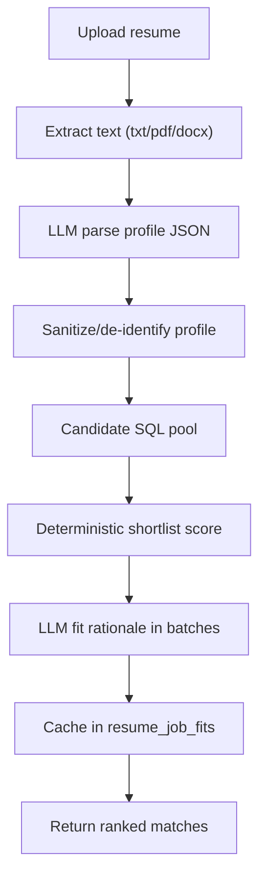

## 8.2 Score composition

Deterministic score uses weighted factors:

- matched skills,
- role-family alignment,
- seniority compatibility,
- target role title overlap,
- sector/domain overlap,
- freshness bonus.

LLM then enriches explanation fields (`why`, `gaps`, `resume_pointers`) and can adjust fit score.

## 8.3 Annotated code lens: safety and caching

```python
# core idea (annotated)

resume_hash = sha256(resume_text)
profile = parse_resume_profile(resume_text)
resume_id = upsert_resume_profile(...)

pool = get_jobs_for_fit_pool(**candidate_filters(profile))
shortlisted = shortlist_jobs(profile, pool)

for job in shortlisted:
    cached = get_cached_resume_fit(resume_id, job["id"], PROMPT_VERSION)
    if cached:
        use cached
    else:
        request LLM fit batch
        save_resume_fit(..., prompt_version=PROMPT_VERSION)
```

Key design decision: prompt version is part of cache key so prompt/model shifts do not silently mix old semantics.

---

## Section 9: FastAPI service (`api/app.py`)

## 9.1 Service shape

`api/app.py` is intentionally thin:

- initialize DB,
- configure CORS,
- map routes -> query functions,
- normalize fit errors.

## 9.2 Endpoint groups

- Overview: `/api/overview`
- Company: `/api/companies`, `/api/companies/{id}`, `/api/companies/velocity`
- Jobs: `/api/jobs`, `/api/jobs/{id}`, `/api/jobs/filters`, `/api/jobs/trends`, `/api/jobs/freshness`
- Taxonomy: `/api/sectors`, `/api/departments`, `/api/seniority`, `/api/work-models`, `/api/role-families`, `/api/skills`
- Changes/cross tabs: `/api/changes/*`, `/api/cross/*`
- Health: `/api/health`
- Fit: `/api/fit/matches`, `/api/fit/jobs/{job_id}`

## 9.3 Annotated code lens: fit error normalization

```python
# intent: convert backend/runtime/model errors into user-friendly HTTP responses

def _fit_error(exc: Exception) -> HTTPException:
    message = str(exc)

    # Missing key -> 503 not configured
    if "GROQ_API_KEY" in message:
        return HTTPException(status_code=503, detail="Resume matching is not configured yet...")

    # Rate limited -> 429
    if "rate_limit_exceeded" in message or "429" in message:
        return HTTPException(status_code=429, detail="Resume matching is temporarily rate-limited...")

    # Provider outage -> 503
    if "Groq API" in message:
        return HTTPException(status_code=503, detail="Resume matching is temporarily unavailable...")

    # Validation/user input errors
    return HTTPException(status_code=400, detail=message)
```

---

## Section 10: Frontend deep tour (`dashboard/`)

## 10.1 UI shell

- `src/app/layout.tsx`: page frame + sidebar.
- `src/components/Sidebar.tsx`: navigation and tracked count.
- `src/app/globals.css`: theme variables and chart tooltip styling.

## 10.2 API client layer

`src/lib/api.ts`:

- central fetch wrappers (`fetchApi`, `postFormApi`),
- TypeScript interfaces,
- one exported `api` object of endpoint calls.

## 10.3 Page cluster map

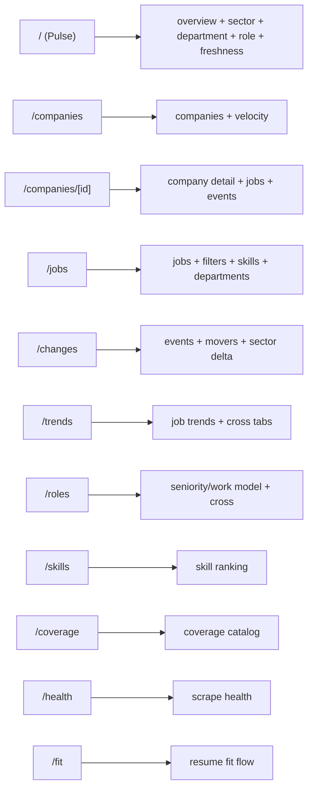

## 10.4 Annotated code lens: `fetchApi`

```ts
// src/lib/api.ts
async function fetchApi<T>(
  path: string,
  params?: Record<string, string | number | string[] | number[] | undefined>
): Promise<T> {
  // Build URL from base env variable and endpoint path.
  const url = new URL(`${API_BASE}${path}`);

  // Serialize query parameters.
  if (params) {
    Object.entries(params).forEach(([k, v]) => {
      // Skip empty values.
      if (v === undefined || v === null || v === "") return;

      // Arrays are joined as comma-separated values.
      if (Array.isArray(v)) {
        const values = v.map((entry) => String(entry).trim()).filter(Boolean);
        if (values.length > 0) {
          url.searchParams.set(k, values.join(","));
        }
        return;
      }

      // Scalar value path.
      url.searchParams.set(k, String(v));
    });
  }

  // Execute request.
  const res = await fetch(url.toString());

  // Throw for non-2xx responses.
  if (!res.ok) throw new Error(`API error: ${res.status}`);

  // Parse typed JSON body.
  return res.json();
}
```

## 10.5 Frontend visual behavior design

- Most pages are client-rendered with `useEffect` fetch calls.
- Recharts drives chart visuals.
- Multi-select filter UX via `MultiValuePicker`.
- CSV export helper in `src/lib/export.ts`.

---

## Section 11: Scripts atlas (`scripts/`)

## 11.1 Operational categories

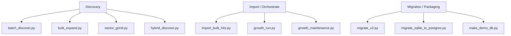

## 11.2 Script-by-script quick cards

| Script | Current purpose |
|---|---|
| `batch_discover.py` | async ATS slug probing from candidate names |
| `bulk_expand.py` | broad discovery and YAML config generation |
| `import_bulk_hits.py` | inserts hits into canonical companies |
| `growth_run.py` | one command for discovery + import + scrape + maintenance |
| `growth_maintenance.py` | quality gates and tagging |
| `sector_grind.py` | sector batch discovery and direct add |
| `hybrid_discover.py` | intended staged discovery flow |
| `migrate_v2.py` | schema migration helper |
| `migrate_sqlite_to_postgres.py` | intended DB transfer utility |
| `make_demo_db.py` | create lightweight demo DB |

## 11.3 Annotated code lens: `growth_run.py` orchestrator pattern

```python
# idea: run multiple lanes with optional skips and summarize results

def _discover_and_import(...):
    # 1) Run batch_discover.py -> raw hits JSON
    # 2) Add source metadata/confidence
    # 3) Run import_bulk_hits.py
    # 4) Return lane summary
    ...


def main():
    # Parse flags (skip lanes, skip scrape, skip maintenance).
    ...

    # Run midmarket lane unless skipped.
    ...

    # Run general lane unless skipped.
    ...

    # Run tracker scrape unless skipped.
    ...

    # Run maintenance unless skipped.
    ...

    # Print final JSON summary.
    ...
```

---

## Section 12: Legacy Streamlit app (`dashboard.py`)

## 12.1 Why it still exists

Legacy Streamlit interface still provides:

- quick local exploration,
- alternate lens for overview/jobs/trends,
- shared query-layer verification.

It is not the primary frontend now, but useful for fallback validation.

---

## Section 13: Environment variables and runtime contracts

| Variable | Used by | Purpose |
|---|---|---|
| `TRACKER_DB_PATH` | `db/models.py` | override DB file path |
| `FRONTEND_URL` | `api/app.py` | add CORS allowed origin |
| `NEXT_PUBLIC_API_URL` | `dashboard/src/lib/api.ts` | frontend API base URL |
| `GROQ_API_KEY` | `analysis/resume_fit.py` | enable LLM fit path |
| `LLM_MODEL` / `GROQ_MODEL` | `analysis/resume_fit.py` | model override |
| `DATABASE_URL` / `TRACKER_DATABASE_URL` | migration script | postgres target |

---

## Section 14: Current-state drift and risk register

This is based on local inspection and build checks.

## 14.1 Frontend contract drift

- `dashboard/src/app/analyst/page.tsx` and `dashboard/src/app/radar/page.tsx` reference API types/functions not present in `dashboard/src/lib/api.ts`.
- Confirmed by `npm run build` type error for missing `AnalystCohortResponse` export.

## 14.2 Backend feature gap for new pages

- No corresponding watchlist/radar/analyst API routes in tracked `api/app.py`.
- No matching query functions in current `db/queries.py`.

## 14.3 Script drift

- `scripts/hybrid_discover.py` references discovery-stage query functions not present in current query module.
- `scripts/migrate_sqlite_to_postgres.py` expects connection abstraction not present in current SQLite-only `db/models.py`.
- `scripts/growth_run.py` sets `TRACKER_COMPANY_SOURCE`, but `tracker.py` currently does not consume that variable.

## 14.4 Query safety note

- `get_overview_stats` currently interpolates `company_type` using string formatting.
- Caller values are constrained in current UI paths, but parameterized SQL is safer and recommended.

---

## Section 15: End-to-end operational cookbook

## 15.1 Daily run commands

```bash
cd /Users/imanbaghai/Desktop/startup-tracker
python3 -m venv .venv
source .venv/bin/activate
pip install -r requirements.txt
python tracker.py
uvicorn api.app:app --reload --port 8000
```

New terminal:

```bash
cd /Users/imanbaghai/Desktop/startup-tracker/dashboard
npm install
npm run dev
```

Health checks:

- [http://localhost:8000/api/overview](http://localhost:8000/api/overview)
- [http://localhost:3000](http://localhost:3000)

## 15.2 Change analysis routine

1. Open Changes page.
2. Validate opened vs closed totals.
3. Inspect movers by 7d/30d windows.
4. Cross-check with Health page for scrape failures.

---

## Section 16: File-by-file walkthrough index

Use this index to read source quickly.

### 16.1 Backend core

- `tracker.py`
- `db/models.py`
- `db/queries.py`
- `api/app.py`

### 16.2 Analysis

- `analysis/nlp.py`
- `analysis/resume_fit.py`

### 16.3 Scrapers

- `scraper/base.py`
- `scraper/ashby.py`
- `scraper/greenhouse.py`
- `scraper/lever.py`
- `scraper/smartrecruiters.py`
- `scraper/teamtailor.py`
- `scraper/playwright_scraper.py`
- `scraper/static_html.py`
- `scraper/workable.py` (present, not wired in main dispatch)
- `scraper/workday.py` (present, not wired in main dispatch)
- `scraper/enrichment.py`

### 16.4 Frontend route pages

- `dashboard/src/app/page.tsx` (Pulse)
- `dashboard/src/app/companies/page.tsx`
- `dashboard/src/app/companies/[id]/page.tsx`
- `dashboard/src/app/jobs/page.tsx`
- `dashboard/src/app/changes/page.tsx`
- `dashboard/src/app/trends/page.tsx`
- `dashboard/src/app/roles/page.tsx`
- `dashboard/src/app/skills/page.tsx`
- `dashboard/src/app/coverage/page.tsx`
- `dashboard/src/app/compare/page.tsx`
- `dashboard/src/app/health/page.tsx`
- `dashboard/src/app/fit/page.tsx`
- `dashboard/src/app/radar/page.tsx` (contract drift)
- `dashboard/src/app/analyst/page.tsx` (contract drift)

### 16.5 Frontend infra

- `dashboard/src/app/layout.tsx`
- `dashboard/src/app/globals.css`
- `dashboard/src/components/Sidebar.tsx`
- `dashboard/src/components/MultiValuePicker.tsx`
- `dashboard/src/lib/api.ts`
- `dashboard/src/lib/format.ts`
- `dashboard/src/lib/export.ts`

### 16.6 Scripts

- all files under `scripts/` (discovery, maintenance, migration utilities)

---

## Section 17: Suggested hardening roadmap

Priority 1 (contract alignment):

1. Add missing API types/functions in `dashboard/src/lib/api.ts` for analyst/radar, or remove routes from nav until backend exists.
2. Implement missing backend/query support for watchlists/radar/analyst, or park pages.

Priority 2 (script hygiene):

1. Either restore discovery-stage query functions used by `hybrid_discover.py` or archive script.
2. Align `migrate_sqlite_to_postgres.py` with actual connection layer.
3. Wire `TRACKER_COMPANY_SOURCE` in tracker or remove option from `growth_run.py`.

Priority 3 (safety and quality):

1. Parameterize `get_overview_stats` SQL.
2. Add tests around `sync_jobs` lifecycle transitions.
3. Add API integration tests for top endpoints.

---

## Section 18: Visual quick-reference cards

## 18.1 Architecture card

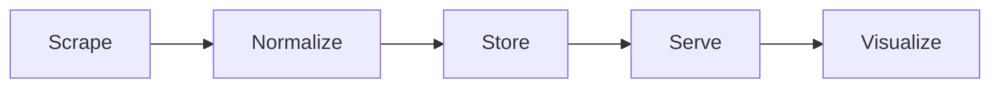

## 18.2 Core state card

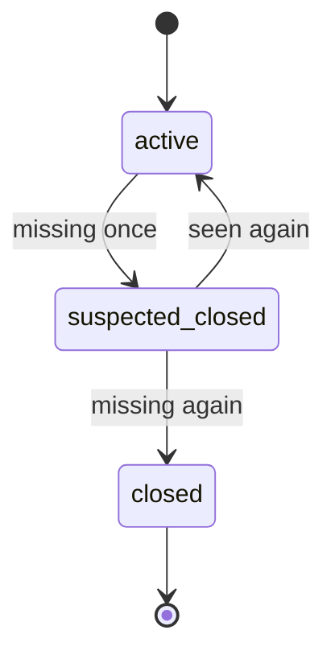

## 18.3 Data confidence card

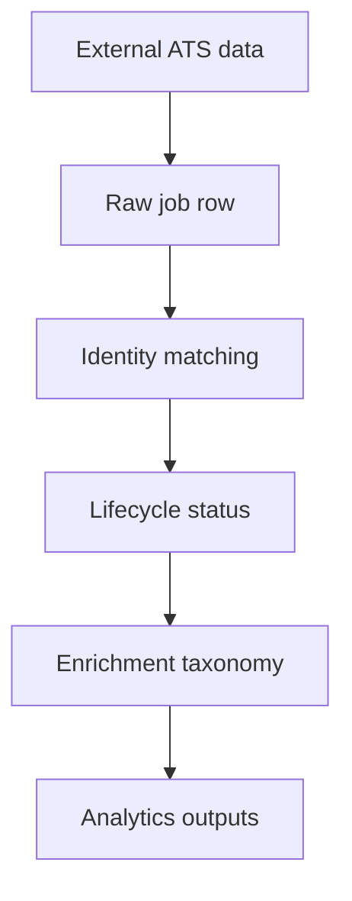

---

## Appendix A: fully commented mini replicas of key core patterns

These are learning replicas (not full production code) used to teach intent.

### A.1 Query filter helper pattern

```python
# Helper: split comma-separated strings or arrays into clean list.
def _split_filter_values(value) -> list[str]:
    # None -> no filters.
    if value is None:
        return []

    # If value already list-like, stringify each element.
    if isinstance(value, (list, tuple, set)):
        raw_values = [str(item) for item in value]
    else:
        # Otherwise split CSV string.
        raw_values = str(value).split(",")

    # Trim whitespace and remove empties.
    return [item.strip() for item in raw_values if str(item).strip()]
```

### A.2 API route wrapper pattern

```python
# Thin endpoint wrapper:
# - parse query params
# - call query function
# - return JSON-ready result

@app.get("/api/seniority")
def seniority(company_type: Optional[str] = None):
    return queries.get_seniority_breakdown(company_type=company_type)
```

### A.3 Frontend fetch pattern

```ts
// Frontend endpoint call pattern:
// 1) build URL
// 2) attach params
// 3) fetch
// 4) throw on non-OK
// 5) parse JSON

const data = await fetchApi<OverviewStats>("/api/overview", { company_type: "startup" });
```

---

## Appendix B: build verification snapshot

Observed locally during atlas creation:

- Core backend and most dashboard pages are wired.
- Full dashboard production build currently fails at missing analyst/radar API type exports.

Use this as a known baseline while planning next fixes.


---

## Section 1 Addendum: Tutorial Side-by-Side Code Companion

This addendum is the "read code like a map" version of the tutorial.  
Each row gives:

- Code snippet
- What it does
- What output/result you should see

### A1. Tutorial Mission Matrix

| Mission | Code focus | What it does | Expected output |
|---|---|---|---|
| Mission 2 | `db/models.py` | Creates schema and DB connection defaults | `DB created` + file in `data/tracker.db` |
| Mission 3 | `scraper/base.py`, `scraper/greenhouse.py` | Pulls jobs from Greenhouse and normalizes fields | job count + sample title |
| Mission 4 | `db/queries.py::sync_jobs` | Dedupe, insert, close missing jobs, log events | `added/removed` metrics update |
| Mission 5 | `tracker.py` | End-to-end scrape -> sync run | one line per company with found/added/removed |
| Mission 6 | `api/app.py` | Exposes `/api/overview` | JSON response in browser |
| Mission 7 | `dashboard/src/app/page.tsx` | Fetches API and renders values | visible cards/text in browser |
| Mission 8 | `enrichment.py`, `nlp.py` | Backfill metadata and extract basic skills | `enriched: N`, `skills: M` |

### A2. Tutorial DB Layer (side-by-side)

#### Code

```python
# db/models.py
DB_PATH = Path("data/tracker.db")

conn = sqlite3.connect(DB_PATH)
conn.row_factory = sqlite3.Row
conn.execute("PRAGMA journal_mode=WAL")
conn.execute("PRAGMA foreign_keys=ON")
```

#### What it does

- Picks local DB file path.
- Opens SQLite connection.
- Enables dict-like row access.
- Enables WAL mode for better read/write behavior.
- Turns on foreign key protection.

#### Output/result

- A SQLite DB file appears at `data/tracker.db`.
- Tables can reference each other safely.

### A3. Tutorial Scraper Layer (side-by-side)

#### Code

```python
# scraper/greenhouse.py
url = f"https://boards-api.greenhouse.io/v1/boards/{slug}/jobs?content=true"
...
jobs.append(
  JobPosting(
    title=row.get("title", ""),
    external_id=str(row.get("id")) if row.get("id") else None,
    location=(row.get("location") or {}).get("name"),
    department=((row.get("departments") or [{}])[0]).get("name"),
    url=row.get("absolute_url"),
  )
)
```

#### What it does

- Calls Greenhouse board API.
- Converts raw provider fields into common `JobPosting` shape.
- Keeps stable `external_id` for dedupe during sync.

#### Output/result

Example shape returned (list item):

```json
{
  "title": "Software Engineer, Backend",
  "company": "Stripe",
  "external_id": "1234567",
  "location": "San Francisco, CA",
  "department": "Engineering",
  "url": "https://boards.greenhouse.io/..."
}
```

### A4. Tutorial Sync Engine (side-by-side)

#### Code

```python
# db/queries.py::sync_jobs (core logic)
if ext_id and ext_id in by_external_id:
    existing_id = by_external_id[ext_id]
...
if existing_id:
    UPDATE job_postings SET last_seen_at=..., is_active=1
else:
    INSERT INTO job_postings(...)
    INSERT INTO job_events(..., 'added')
...
if row['id'] not in matched_ids:
    UPDATE job_postings SET is_active=0, posting_status='closed'
    INSERT INTO job_events(..., 'removed')
```

#### What it does

- Matches scraped job to existing active row.
- Updates existing row if matched.
- Inserts new row if not matched.
- Closes rows not seen this run.
- Creates `added/removed` events for timeline analytics.

#### Output/result

- Accurate active job set.
- Change history in `job_events`.
- Run metrics in `scrape_runs`.

### A5. Tutorial API Layer (side-by-side)

#### Code

```python
@app.get('/api/overview')
def overview(company_type: Optional[str] = None):
    return queries.get_overview_stats(company_type=company_type)
```

#### What it does

- Accepts optional company type filter.
- Calls query-layer aggregation function.
- Returns JSON payload directly.

#### Output/result

Example response:

```json
{
  "total_companies": 2,
  "total_active_jobs": 145,
  "last_run": "2026-04-18 20:10:51",
  "net_added": 0,
  "net_removed": 0
}
```

### A6. Tutorial Frontend Layer (side-by-side)

#### Code

```tsx
useEffect(() => {
  fetch("http://localhost:8000/api/overview")
    .then((r) => r.json())
    .then(setData)
}, [])
```

#### What it does

- Calls API once on page load.
- Stores response in component state.
- React re-renders with loaded values.

#### Output/result

- Loading state first.
- Then totals rendered on page.

### A7. Tutorial full-run output examples

Expected command outputs:

```bash
python3 tracker.py
# Stripe: found=92 added=92 removed=0
# Notion: found=53 added=53 removed=0
```

```bash
python3 - <<'PY'
from scraper.enrichment import enrich_all
from analysis.nlp import extract_all_skills
print('enriched:', enrich_all())
print('skills:', extract_all_skills())
PY
# enriched: 145
# skills: 38
```

---

## Section 2 Addendum: Full Project Side-by-Side Code Companion

This is the deep companion for the real repository code.

### B1. Core module matrix (code -> behavior -> output)

| Module | Key function(s) | What it does | Output shape |
|---|---|---|---|
| `tracker.py` | `run`, `scrape_company` | orchestrates scrape/sync/enrich/skills | console run summary |
| `db/models.py` | `get_connection`, `init_db` | DB connection + schema + additive migrations | SQLite DB with latest columns/indexes |
| `db/queries.py` | `sync_jobs`, analytics queries | canonical state + read models | dict/list responses for API |
| `api/app.py` | route handlers | endpoint contracts | JSON over HTTP |
| `analysis/nlp.py` | `extract_all_skills` | regex skill tagging | `job_skills` rows |
| `analysis/resume_fit.py` | fit pipeline | resume profile + scoring + LLM rationale + cache | match payloads |
| `dashboard/src/lib/api.ts` | `fetchApi`, `api.*` | typed frontend API access | TS-typed responses |

### B2. `tracker.py` side-by-side

#### Code (focus)

```python
tasks = [scrape_company(c, company_ids[c['name']]) for c in companies]
results = await asyncio.gather(*tasks, return_exceptions=True)
...
from scraper.enrichment import enrich_all
enriched = enrich_all()
...
from analysis.nlp import extract_all_skills
skills = extract_all_skills()
```

#### What it does

- Scrapes all configured companies concurrently.
- Applies lifecycle sync per company.
- Runs post-processing passes after ingestion.

#### Output/result

Terminal run table:

```text
Company                   ATS          Jobs   New  Gone
------------------------------------------------------
Stripe                    greenhouse     92   +12   -3
...
TOTAL                                  1240  +87  -44
Enriched 1132 jobs
Extracted 429 skill tags
```

### B3. `db/queries.py` sync side-by-side (deep)

#### Code (identity match order)

```python
if ext_id and ext_id in by_ext_id:
    existing_id = by_ext_id[ext_id]
elif canonical_url and canonical_url in by_canonical_url:
    existing_id = by_canonical_url[canonical_url]
elif fingerprint in by_fingerprint:
    existing_id = by_fingerprint[fingerprint]
elif (title_key, location_key) in by_title_location:
    existing_id = by_title_location[(title_key, location_key)]
```

#### What it does

- Uses strongest identifiers first.
- Falls back to weaker but useful title+location composite.
- Reduces duplicate insertions and preserves continuity.

#### Output/result

- Stable job identity through title or URL changes.
- Better add/remove accuracy.

#### Code (two-step close)

```python
misses = (row['consecutive_misses'] or 0) + 1
should_close = row['posting_status'] == 'suspected_closed' or misses >= 2
```

#### What it does

- Prevents false removals from one-off scrape misses.

#### Output/result

- First miss: `suspected_closed`
- Repeat miss: `closed` + `removed` event

### B4. NLP pipeline (`analysis/nlp.py`) side-by-side

#### Code

```python
_SKILLS = {
  'Python': r'\\bPython\\b',
  'Kubernetes': r'\\bKubernetes\\b|\\bk8s\\b',
  'LLM': r'\\bLLMs?\\b|\\blarge language model\\b',
  ...
}
_COMPILED = {name: re.compile(pattern, re.IGNORECASE) for name, pattern in _SKILLS.items()}

for name, pattern in _COMPILED.items():
    if pattern.search(text):
        found.append(name)
```

#### What it does

- Maintains canonical skill dictionary.
- Compiles regex once.
- Checks each job description for matches.
- Writes discovered skills to `job_skills`.

#### Output/result

Example extraction:

Input text:

```text
We need Python, SQL, and Kubernetes experience. LLM evaluation experience is a plus.
```

Output list:

```json
["Python", "SQL", "Kubernetes", "LLM"]
```

#### Code (`extract_all_skills`)

```python
rows = conn.execute("""
  SELECT jp.id, jp.description
  FROM job_postings jp
  LEFT JOIN job_skills js ON js.job_id = jp.id
  WHERE jp.description IS NOT NULL
    AND js.job_id IS NULL
  GROUP BY jp.id
""").fetchall()
```

#### What it does

- Processes only untagged rows (incremental behavior).
- Avoids redundant re-processing of previously-tagged jobs.

#### Output/result

- Faster repeated runs.
- Predictable growth of skill table.

### B5. AI/LLM fit pipeline (`analysis/resume_fit.py`) side-by-side (deep)

#### Stage 1: Resume text extraction

| Code | What it does | Output |
|---|---|---|
| `extract_resume_text` | loads txt/md/pdf/docx text | plain string resume text |
| PDF path | uses `pypdf.PdfReader` | concatenated page text |
| DOCX path | uses `python-docx` | concatenated paragraph text |

#### Stage 2: LLM profile parse

#### Code

```python
prompt = {
  "task": "Extract a structured resume profile for job matching.",
  "rules": [...],
  "schema": {...},
  "resume_text": resume_text[:24000],
}
profile = _chat_json([
  {"role": "system", "content": "You extract resume facts into strict JSON..."},
  {"role": "user", "content": json.dumps(prompt)},
])
```

#### What it does

- Sends controlled extraction prompt to model.
- Forces strict JSON response format.
- Limits text size to reduce latency and token cost.

#### Output/result

Example parsed profile:

```json
{
  "headline": "Backend engineer with distributed systems and ML platform experience.",
  "target_roles": ["Senior Backend Engineer", "Platform Engineer"],
  "role_families": ["software_engineering", "ml_ai"],
  "seniority": "senior",
  "skills": ["Python", "Go", "Kubernetes", "PostgreSQL", "LLM"],
  "domains": ["Fintech", "Developer Tools"],
  "strengths": ["Built high-scale APIs", "Led platform reliability work"],
  "remote_preference": "remote_preferred"
}
```

#### Stage 3: Profile sanitization / de-identification

#### Code

```python
clean = {key: profile.get(key) for key in PROFILE_ALLOWED_KEYS if key in profile}
clean['headline'] = _redact_pii_text(clean.get('headline') or '')
clean['skills'] = _clean_string_list(clean.get('skills'), limit=80)
```

#### What it does

- Keeps only matching-relevant keys.
- Redacts direct PII patterns (email/phone/urls/name-like forms).
- Normalizes array lengths and contents.

#### Output/result

- Safe compact profile persisted in `resume_profiles`.

#### Stage 4: Candidate pool SQL narrowing

#### Code

```python
pool = queries.get_jobs_for_fit_pool(
  skills=..., role_families=..., seniorities=..., title_terms=..., domains=...
)
```

#### What it does

- Reduces job universe before expensive LLM fit.
- Uses OR-based candidate clauses to increase recall.

#### Output/result

- Candidate list (often hundreds) instead of full table.

#### Stage 5: Deterministic scoring

#### Code

```python
score += min(len(overlap) * 8.0, 40.0)
if row.get('role_family') in profile_roles: score += 25.0
if _seniority_compatible(...): score += 15.0
score += _title_similarity(...) * 12.0
if _sector_match(...): score += 5.0
score += _freshness_score(...)
```

#### What it does

- Creates stable base ranking independent of LLM variability.

#### Output/result

- `deterministic_score` in `0..100` with matched skill list.

#### Stage 6: LLM fit rationale batch

#### Code

```python
packet = {
  'task': 'Evaluate resume fit for each job. Return only valid JSON.',
  'response_schema': {'fits': [{...}]},
  'resume_profile': profile,
  'jobs': [_job_packet(job) for job in jobs],
}
fits = _request_fit_batch(profile, chunk)
```

#### What it does

- Requests model explanations per shortlisted chunk (size 8).
- Uses strict output schema to simplify parser and UI rendering.

#### Output/result

Per-job fit object:

```json
{
  "job_id": 18273,
  "fit_score": 84,
  "verdict": "strong fit",
  "why": ["Strong overlap in backend and platform skills"],
  "gaps": ["Less explicit payments domain depth"],
  "resume_pointers": ["Add quantified impact for API latency/reliability work"],
  "location_note": "Location was not scored. Job location: New York, NY.",
  "location_blocker": false
}
```

#### Stage 7: Cache + merge

#### Code

```python
cached = queries.get_cached_resume_fit(resume_id, job['id'], PROMPT_VERSION)
if cached: ... else: queries.save_resume_fit(...)
```

#### What it does

- Prevents paying for repeated identical comparisons.
- Keeps deterministic score and LLM rationale aligned by prompt version.

#### Output/result

- Faster repeated fit queries.
- Stable historical fit records.

### B6. API route side-by-side (whole app)

| Route family | Code shape | What it does | Output |
|---|---|---|---|
| overview | `return queries.get_overview_stats(...)` | KPI cards | dict |
| jobs | `return queries.get_active_jobs(...)` | filtered feed | list of jobs |
| changes | `return queries.get_recent_events(...)` | activity timeline | list events |
| trends | `return queries.get_job_count_over_time()` | time series | list points |
| fit | parse upload -> call analysis funcs | resume comparison | fit payload |

### B7. Next.js visuals assembly (deep)

This section explains how visuals are made in the frontend, from data to chart.

#### B7.1 Visual pipeline map

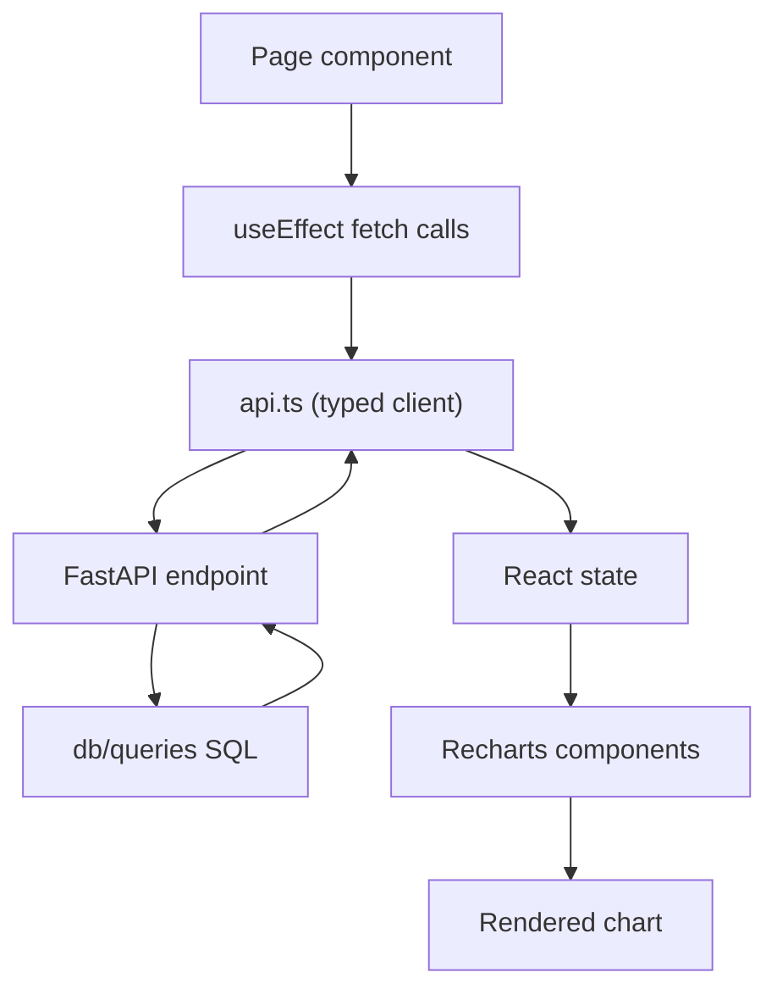

#### B7.2 API client and query param shaping

#### Code

```ts
if (Array.isArray(v)) {
  const values = v.map((entry) => String(entry).trim()).filter(Boolean);
  if (values.length > 0) {
    url.searchParams.set(k, values.join(","));
  }
}
```

#### What it does

- Converts multi-select filters into comma-separated query params.
- Backend `_split_filter_values` turns those back into arrays.

#### Output/result

- Works for filter UIs like skills/department/sector multi-pickers.

#### B7.3 React state-to-visual binding

#### Code

```tsx
const [sectors, setSectors] = useState<SectorRow[]>([])
useEffect(() => {
  api.sectors().then(setSectors)
}, [])

<BarChart data={sectors}>
  <Bar dataKey="job_count" />
</BarChart>
```

#### What it does

- Stores API rows in component state.
- Passes same rows directly to chart as `data`.
- `dataKey` maps chart axis/bar to object fields.

#### Output/result

- Chart updates automatically when state changes.

#### B7.4 Recharts key pieces (how to read)

| Component | Role |
|---|---|
| `ResponsiveContainer` | auto-resize chart to container |
| `BarChart` / `LineChart` / `PieChart` | chart type container |
| `XAxis` / `YAxis` | axis configuration |
| `Bar` / `Line` / `Pie` | data series |
| `Tooltip` | hover details |
| `Legend` | series labels |
| `Cell` | per-bar/per-slice color customization |

#### B7.5 Styling system for visuals

`globals.css` defines color tokens:

```css
:root {
  --background: #0f1117;
  --card: #1a1d27;
  --card-border: #2a2d3a;
  --accent: #6366f1;
  --muted: #9ca3af;
}
```

Then chart components use these tokens or aligned hex palettes.

#### B7.6 Example: Pulse page visual assembly

| Step | Code | Effect |
|---|---|---|
| 1 | `api.overview(ct).then(setOverview)` | loads KPI totals |
| 2 | `api.sectors().then(setSectors)` | loads sector bars |
| 3 | `api.departments(ct).then(setDepartments)` | loads dept chart |
| 4 | conditional render if no `overview` | loading state |
| 5 | `KpiCard` components | metric cards |
| 6 | `BarChart` + `PieChart` | visual distributions |
| 7 | `scope` toggle state | startup-only vs all data |

### B8. Output contracts by domain (reference)

#### B8.1 Overview output

```json
{
  "total_companies": 432,
  "total_active_jobs": 11876,
  "last_run": "2026-04-18 20:42:09",
  "net_added": 231,
  "net_removed": 174
}
```

#### B8.2 Job row output

```json
{
  "id": 9182,
  "company_id": 51,
  "title": "Senior Data Engineer",
  "company_name": "ExampleCo",
  "sector": "Data & Analytics",
  "seniority": "senior",
  "work_model": "hybrid",
  "normalized_department": "Engineering",
  "role_family": "data",
  "is_active": 1
}
```

#### B8.3 Fit match output

```json
{
  "job": {"id": 9182, "title": "Senior Data Engineer", "company_name": "ExampleCo"},
  "deterministic_score": 79.5,
  "fit_score": 84,
  "verdict": "strong fit",
  "why": ["..."],
  "gaps": ["..."],
  "resume_pointers": ["..."],
  "location_note": "Location was not scored...",
  "location_blocker": false,
  "cached": true
}
```

### B9. Full project + tutorial crosswalk matrix

| Tutorial concept | Full project equivalent | Why it matters |
|---|---|---|
| one scraper | multiple ATS adapters | improves coverage |
| simple sync | multi-identifier + lifecycle | improves data quality |
| one endpoint | full endpoint families | supports many dashboards |
| one page | multi-page analytics UI | role-specific workflows |
| basic regex skills | larger canonical skill dictionary | better signal depth |
| no fit cache | versioned fit cache tables | faster repeated queries |

### B10. Suggested learning sequence for deep understanding

1. Read tutorial mission matrix and run commands once.
2. Read full-project module matrix.
3. Study NLP and AI side-by-side sections.
4. Study Next.js visual pipeline section.
5. Trace one page fully: `api.ts` -> endpoint -> query -> SQL -> back to chart.
6. Repeat for fit flow.


### B11. 1:1 Visual Output Atlas (Screenshots + Code + Output)

This section is the exact map from screen pixels to code and data.

How to read each card:

1. Screenshot: what the browser shows.
2. Frontend code: where the page fetches and renders.
3. Backend code: which route/query supplies the data.
4. Live output: real JSON returned by this running project.

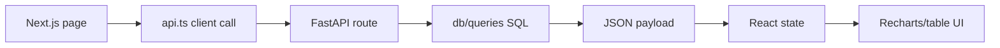

#### B11.1 Pulse (`/`) — `01-pulse.png`


**Frontend code (fetch + render)**

```tsx
// dashboard/src/app/page.tsx (lines 46-53)
// On scope change, fetch every dataset needed for KPI cards and charts.
useEffect(() => {
  const ct = scope === "startup" ? "startup" : undefined;
  api.overview(ct).then(setOverview);
  api.sectors().then(setSectors);
  api.departments(ct).then(setDepartments);
  api.roleFamilies(ct).then(setRoleFamilies);
  api.jobFreshness(ct).then(setFreshness);
}, [scope]);

// dashboard/src/app/page.tsx (lines 95-198)
// Recharts reads state arrays directly:
// - sectors -> BarChart (dataKey job_count)
// - departments -> BarChart or PieChart
// - roleFamilies -> BarChart
// - freshness -> BarChart
```

**Backend route + query**

- Route: `api/app.py` line `45` (`/api/overview`)
- Query: `db/queries.py` line `1051` (`get_overview_stats`)

**Live output sample**

```json
{
  "total_companies": 527,
  "total_active_jobs": 32386,
  "last_run": "2026-04-14 19:26:38",
  "net_added": 27,
  "net_removed": 416
}
```

---

#### B11.2 Companies (`/companies`) — `02-companies.png`


**Frontend code**

```tsx
// dashboard/src/app/companies/page.tsx (lines 28-35)
// Load company rows + 7-day velocity map once.
useEffect(() => {
  api.companies().then(setCompanies);
  api.companyVelocity(7).then((rows) => {
    const map: Record<number, number> = {};
    rows.forEach((r) => { map[r.company_id] = r.net; });
    setVelocity(map);
  });
}, []);
```

**Backend**

- `/api/companies` -> `get_company_stats` (`db/queries.py:312`)
- `/api/companies/velocity` -> `get_company_velocity` (`db/queries.py:855`)

**Live output sample**

```json
[
  {
    "id": 6207,
    "name": "Anduril Industries",
    "company_type": "startup",
    "active_jobs": 1821,
    "last_scraped": "2026-04-14 19:26:19"
  }
]
```

---

#### B11.3 Job Feed (`/jobs`) — `03-jobs.png`


**Frontend code**

```tsx
// dashboard/src/app/jobs/page.tsx (lines 39-69)
// Load filter dictionaries + metadata for chips and pickers.
useEffect(() => {
  void Promise.all([
    api.skills(undefined, 95),
    api.departments(),
    api.jobFreshness(),
    api.companies(),
    api.jobFilters(),
  ]).then(...);
}, []);

// dashboard/src/app/jobs/page.tsx (lines 84-100)
// Refetch jobs every time filters change.
useEffect(() => {
  return api.jobs(filters).then(setJobs);
}, [filters]);
```

**Backend**

- `/api/jobs` -> `get_active_jobs` (`db/queries.py:370`)
- `/api/jobs/filters` -> `get_filter_options` (`db/queries.py:966`)

**Live output sample**

```json
[
  {
    "id": 44080,
    "title": "Associate Principle Engineer",
    "company_name": "Saviynt",
    "seniority": "mid",
    "work_model": "onsite",
    "normalized_department": "Sales",
    "role_family": "sales"
  }
]
```

---

#### B11.4 Changes (`/changes`) — `04-changes.png`


**Frontend code**

```tsx
// dashboard/src/app/changes/page.tsx (lines 27-37)
useEffect(() => {
  api.changeEvents({ limit: 500, event_type: typeFilter || undefined }).then(setEvents);
}, [typeFilter]);

useEffect(() => {
  api.movers(days).then(setMovers);
}, [days]);

useEffect(() => {
  api.sectorDelta().then(setSectorDelta);
}, []);
```

**Backend**

- `/api/changes/events` -> `get_recent_events` (`db/queries.py:1103`)
- `/api/changes/movers` -> `get_fastest_movers` (`db/queries.py:1134`)
- `/api/changes/sector-delta` -> `get_sector_delta` (`db/queries.py:1220`)

**Live output sample**

```json
[
  {
    "event_type": "removed",
    "created_at": "2026-04-14 19:26:38",
    "title": "Accounts Payable Specialist",
    "company": "WHOOP"
  }
]
```

---

#### B11.5 Trends (`/trends`) — `05-trends.png`


**Frontend code**

```tsx
// dashboard/src/app/trends/page.tsx (lines 56-60)
useEffect(() => {
  api.jobTrends().then(setRaw);
  api.deptSectorCross().then(setCrossTab);
  api.remoteSectorCross("startup").then(setRemoteMix);
}, []);

// Then useMemo pivots raw arrays into chart-ready series (lines 62-121)
// and renders LineChart/AreaChart/BarChart blocks (lines 142-248).
```

**Backend**

- `/api/jobs/trends` -> `get_job_count_over_time` (`db/queries.py:983`)
- `/api/cross/dept-sector` -> `get_dept_sector_cross` (`db/queries.py:1245`)
- `/api/cross/remote-sector` -> `get_remote_mix_by_sector` (`db/queries.py:800`)

**Live output sample**

```json
[
  {
    "company": "Harvey",
    "sector": "AI & Machine Learning",
    "date": "2026-04-04",
    "job_count": 212
  }
]
```

---

#### B11.6 Skills (`/skills`) — `06-skills.png`


**Frontend code**

```tsx
// dashboard/src/app/skills/page.tsx (lines 21-25)
useEffect(() => {
  api.skills(undefined, 30).then(setAllSkills);
  api.skills("startup", 25).then(setStartupSkills);
  api.skills("bigco", 25).then(setBigcoSkills);
}, []);
```

**Backend**

- `/api/skills` -> `get_skill_counts` (`db/queries.py:1197`)
- Data source table is populated by NLP extraction: `analysis/nlp.py:149`

**Live output sample**

```json
[
  { "skill": "Go", "count": 7072 },
  { "skill": "Python", "count": 5959 },
  { "skill": "AWS", "count": 3967 }
]
```

---

#### B11.7 Roles (`/roles`) — `07-roles.png`


**Frontend code**

```tsx
// dashboard/src/app/roles/page.tsx (lines 60-68)
useEffect(() => {
  api.seniority("startup").then((d) => setSenStartup(sortSeniority(d)));
  api.seniority("bigco").then((d) => setSenBigco(sortSeniority(d)));
  api.workModels("startup").then((d) => setWmStartup(mapWorkModelLabels(d)));
  api.workModels("bigco").then((d) => setWmBigco(mapWorkModelLabels(d)));
  api.senioritySectorCross().then(setSeniorityCross);
  api.departments("startup").then(setDeptStartup);
  api.departments("bigco").then(setDeptBigco);
}, []);
```

**Backend**

- `/api/seniority` -> `get_seniority_breakdown` (`db/queries.py:1157`)
- `/api/work-models` -> `get_work_model_breakdown` (`db/queries.py:1177`)
- `/api/cross/seniority-sector` -> `get_seniority_sector_cross` (query module)

**Live output sample**

```json
[
  { "seniority": "mid", "count": 10127 },
  { "seniority": "senior", "count": 5675 },
  { "seniority": "manager", "count": 3081 }
]
```

---

#### B11.8 Coverage (`/coverage`) — `08-coverage.png`


**Frontend code**

```tsx
// dashboard/src/app/coverage/page.tsx (lines 17-19)
useEffect(() => {
  api.companies().then(setCompanies);
}, []);

// UI groups startups by sector and toggles grid/list views (lines 58-69, 142-182).
```

**Backend**

- `/api/companies` -> `get_company_stats` (`db/queries.py:312`)

**Live output sample**

```json
[
  {
    "id": 3670,
    "name": "SpaceX",
    "company_type": "bigco",
    "sector": "Robotics & Hardware",
    "active_jobs": 1546
  }
]
```

---

#### B11.9 Health (`/health`) — `09-health.png`


**Frontend code**

```tsx
// dashboard/src/app/health/page.tsx (lines 41-46)
useEffect(() => {
  api.health().then((data) => {
    setRows(data);
    setLoading(false);
  });
}, []);

// statusBadge classifies rows into OK/Error/Stale and drives KPI cards.
```

**Backend**

- `/api/health` -> `get_scraper_health` (`db/queries.py:936`)

**Live output sample**

```json
[
  {
    "id": 6211,
    "name": "Unify",
    "status": "failed",
    "jobs_found": 0,
    "active_jobs": 9,
    "error_msg": "Lever scrape failed for 'Unify': "
  }
]
```

---

#### B11.10 Resume Fit (`/fit`) — `10-fit.png`


**Frontend code**

```tsx
// dashboard/src/app/fit/page.tsx (lines 94-124)
// If jobId is present -> compare one job.
// Otherwise -> search top N matches.
if (trimmedJobId) {
  const data = await api.fitJob(numericJobId, file);
  setResult(data);
} else {
  const data = await api.fitMatches(file, { company_type: companyType || undefined, limit });
  setResult(data);
}
```

**Backend**

- `/api/fit/matches` -> `analyze_resume_matches` (`analysis/resume_fit.py:70`)
- `/api/fit/jobs/{job_id}` -> `analyze_single_job` (`analysis/resume_fit.py:109`)

**Live output sample (current environment)**

```json
{
  "detail": "Resume matching is not configured yet. Try again later."
}
```

---

#### B11.11 Company Detail (`/companies/{id}`) — `11-company-detail.png`


**Frontend code**

```tsx
// dashboard/src/app/companies/[id]/page.tsx (lines 45-58)
// Load detail card, full job list, velocity, and then activity events.
Promise.all([
  api.companyDetail(id),
  api.jobs({ company_id: id }),
  api.companyVelocity(7),
]).then(([det, jobList, vel]) => {
  setDetail(det);
  setJobs(jobList);
  ...
  return api.changeEvents({ company_name: det.name, limit: 20 });
});
```

**Backend**

- `/api/companies/{id}` -> `get_company_detail` (`db/queries.py:875`) + company skills/departments queries
- `/api/jobs?company_id=...` -> `get_active_jobs` (`db/queries.py:370`)
- `/api/changes/events?company_name=...` -> `get_recent_events` (`db/queries.py:1103`)

**Live output sample (Anduril Industries id=6207)**

```json
{
  "id": 6207,
  "name": "Anduril Industries",
  "active_jobs": 1821,
  "top_skills": [
    { "skill": "Computer Vision", "count": 1821 },
    { "skill": "Python", "count": 471 }
  ]
}
```

---

### B12. Deep NLP + AI Side-by-Side (Code -> Behavior -> Output)

This section focuses on the two most "intelligent" paths in this app.

#### B12.1 NLP skill extractor (`analysis/nlp.py`) in plain language

| Code segment | What it does | Output |
|---|---|---|
| `_SKILLS` dictionary (`analysis/nlp.py:13`) | Defines canonical skills and matching regex rules | consistent skill labels like `Python`, `Kubernetes`, `LLM` |
| `_COMPILED` (`analysis/nlp.py:132`) | Compiles regex once for speed | faster repeated extraction |
| `extract_skills` (`analysis/nlp.py:135`) | scans one job description and returns matched skills | list of strings |
| `extract_all_skills` (`analysis/nlp.py:149`) | finds unprocessed jobs, extracts skills, writes `job_skills` | integer total of inserted skill tags |

**Side-by-side code and output**

```python
# analysis/nlp.py (commented teaching replica)
# 1) For each known skill pattern...
for name, pattern in _COMPILED.items():
    # 2) ...if the pattern appears in text, keep canonical skill name.
    if pattern.search(text):
        found.append(name)

# 3) Return canonical list, e.g. ["Python", "SQL", "Kubernetes"].
```

Input text example:

```text
We need Python, SQL, and Kubernetes experience. LLM evaluation is a plus.
```

Output list:

```json
["Python", "SQL", "Kubernetes", "LLM"]
```

This output later powers the Skills page bars (`06-skills.png`).

#### B12.2 AI resume fit engine (`analysis/resume_fit.py`) in plain language

| Stage | Function(s) | What happens | Output |
|---|---|---|---|
| 1. Read file | `extract_resume_text` (`line 49`) | reads `.txt/.md/.pdf/.docx` into plain text | `resume_text` string |
| 2. Parse profile | `parse_resume_profile` (`line 136`) | LLM turns resume into strict JSON profile | structured profile |
| 3. Sanitize | `sanitize_resume_profile` (`line 380`) | removes direct PII and normalizes fields | safe compact profile |
| 4. Build candidate pool | `_candidate_filters` (`line 182`) + `get_jobs_for_fit_pool` (`db/queries.py:600`) | creates broad SQL filters from profile | candidate job list |
| 5. Deterministic score | `_score_job` (`line 301`) | computes stable base score from skill overlap, role family, seniority, title, sector, freshness | `deterministic_score` |
| 6. LLM rationale | `_request_fit_batch` (`line 268`) | asks model for `why`, `gaps`, `resume_pointers` | fit objects per job |
| 7. Cache results | `get_cached_resume_fit` + `save_resume_fit` (`db/queries.py:708`, `726`) | reuses previous fit for same resume+job+prompt version | faster repeated calls |

**Deterministic score code + meaning**

```python
# analysis/resume_fit.py (lines 308-325)
score = 0.0
score += min(len(overlap) * 8.0, 40.0)      # matched skills
if role_family_match: score += 25.0         # role family compatibility
if seniority_match: score += 15.0           # level compatibility
score += title_similarity * 12.0            # title token overlap
if sector_match: score += 5.0               # domain/sector overlap
score += freshness_bonus                     # recency bonus
```

**Live API output in this environment**

```json
{
  "detail": "Resume matching is not configured yet. Try again later."
}
```

Meaning: backend flow is wired, but `GROQ_API_KEY` is missing, so LLM calls are intentionally blocked.

---

### B13. How Visual Design Choices Compile in Node.js / Next.js

This is the exact "how does UI become pixels" path.

#### B13.1 Build-time and runtime chain

1. `npm run dev` starts Next.js dev server.
2. Next.js reads file-system routes from `dashboard/src/app/*`.
3. `"use client"` pages are compiled for browser execution.
4. Tailwind classes in JSX are transformed into generated CSS.
5. `globals.css` variables (`dashboard/src/app/globals.css:3-27`) become theme tokens.
6. Browser loads page JS, runs `useEffect`, fetches API JSON.
7. React state updates trigger re-render.
8. Recharts receives arrays and draws SVG charts.

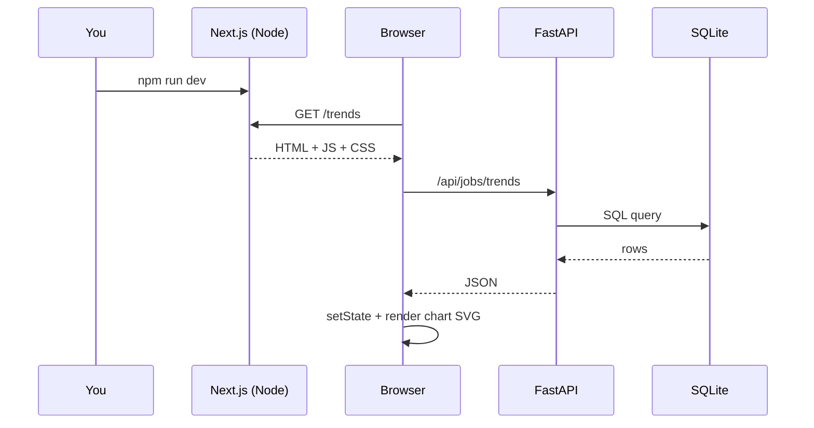

#### B13.2 Design tokens -> visual output

`dashboard/src/app/globals.css` defines the palette that every page uses:

```css
:root {
  --background: #0f1117;
  --foreground: #e5e7eb;
  --card: #1a1d27;
  --card-border: #2a2d3a;
  --accent: #6366f1;
}
```

So when JSX says `className="bg-card border border-card-border"`, the resulting visual card is consistent across all pages.

#### B13.3 Chart grammar (why each chart looks the way it does)

- Data array becomes the chart's `data` prop.
- `dataKey` selects which field maps to axis/series.
- `Cell` or fixed `fill` controls bar/slice colors.
- `Tooltip` style object gives dark tooltip theme.
- `ResponsiveContainer` makes charts fit card width on desktop/mobile.

Example from Pulse page:

```tsx
<BarChart data={sectors} layout="vertical">
  <YAxis dataKey="sector" />
  <Bar dataKey="job_count" />
</BarChart>
```

Translation: one horizontal bar per sector, bar length = `job_count`.

---

### B14. Recreate These 1:1 Screenshots Yourself

Use the same script and viewport used for this book.

```bash
cd /Users/imanbaghai/Desktop/startup-tracker
node /tmp/startuptracker-pdf/capture_app_screenshots.js
```

Generated files:

- `/Users/imanbaghai/Desktop/startup-tracker/docs/screenshots/01-pulse.png`
- `/Users/imanbaghai/Desktop/startup-tracker/docs/screenshots/02-companies.png`
- `/Users/imanbaghai/Desktop/startup-tracker/docs/screenshots/03-jobs.png`
- `/Users/imanbaghai/Desktop/startup-tracker/docs/screenshots/04-changes.png`
- `/Users/imanbaghai/Desktop/startup-tracker/docs/screenshots/05-trends.png`
- `/Users/imanbaghai/Desktop/startup-tracker/docs/screenshots/06-skills.png`
- `/Users/imanbaghai/Desktop/startup-tracker/docs/screenshots/07-roles.png`
- `/Users/imanbaghai/Desktop/startup-tracker/docs/screenshots/08-coverage.png`
- `/Users/imanbaghai/Desktop/startup-tracker/docs/screenshots/09-health.png`
- `/Users/imanbaghai/Desktop/startup-tracker/docs/screenshots/10-fit.png`
- `/Users/imanbaghai/Desktop/startup-tracker/docs/screenshots/11-company-detail.png`

