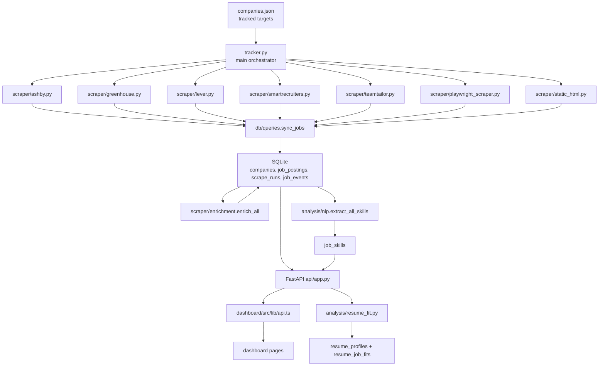
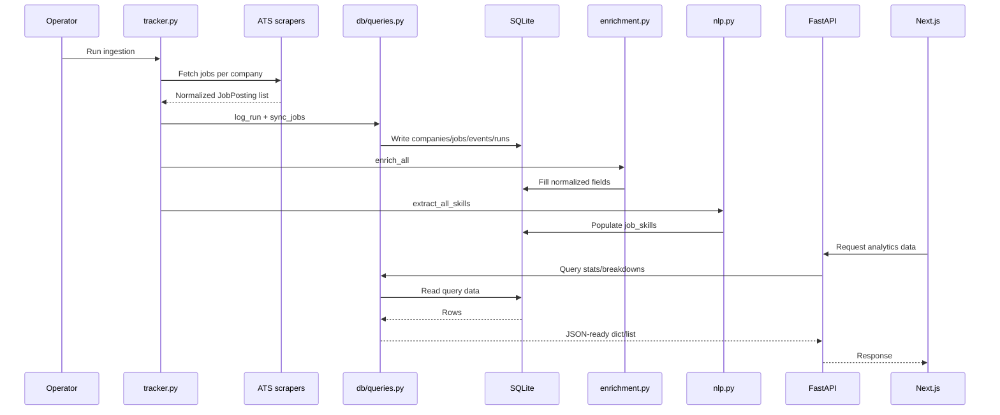
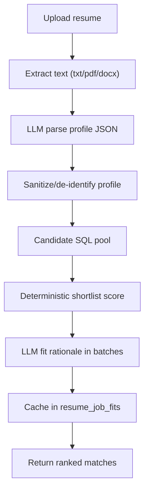
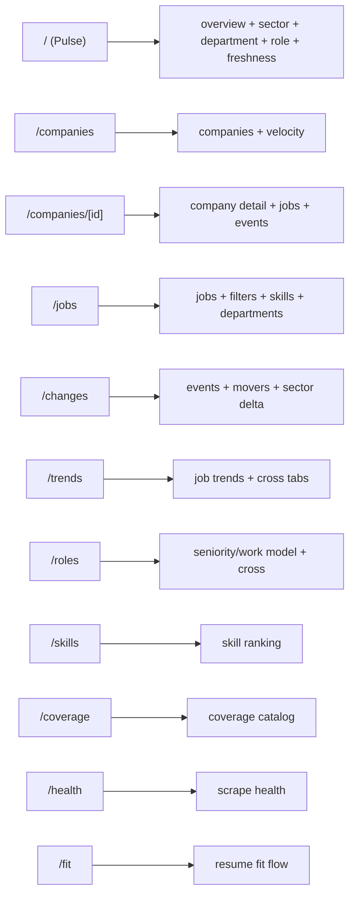
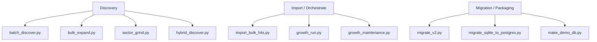
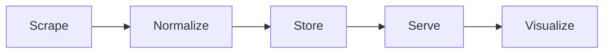
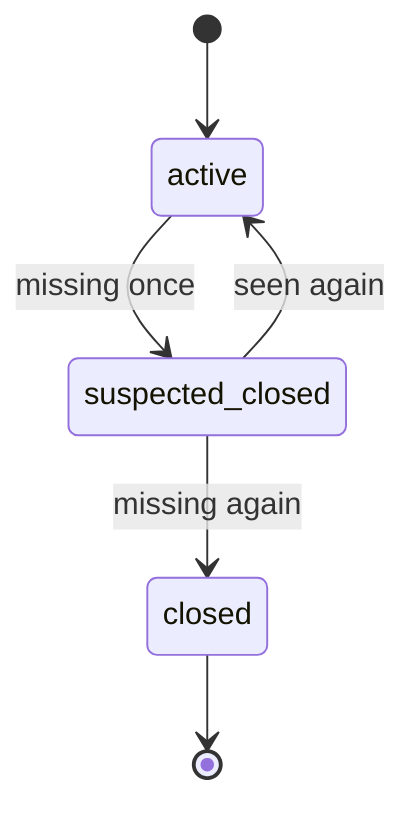
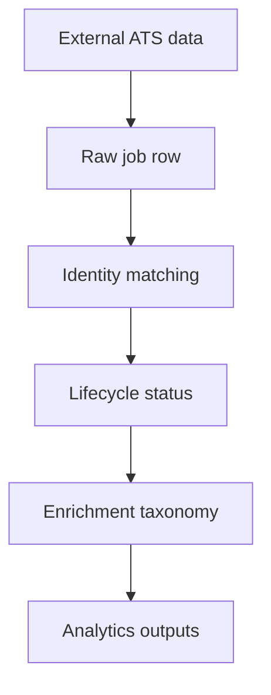

# Startup Tracker Project Atlas (Current Repo Deep Dive)

Audience: builders and operators  
Purpose: understand the exact current project architecture and code flow end-to-end

---

## How this book is organized

This book has two parallel tracks:

- Track A (Visual): architecture diagrams and flow maps.
- Track B (Code Lens): annotated code walkthroughs with line-by-line intent.

Use both together.

---

## Section 1: Whole-system visual model

## 1.1 Current production architecture



## 1.2 Data lifecycle timeline



---

## Section 2: Repository inventory

## 2.1 Top-level map

| Path | Role |
|---|---|
| `tracker.py` | ingestion orchestrator |
| `api/app.py` | REST API surface |
| `db/models.py` | DB connection + schema init |
| `db/queries.py` | write/read query logic |
| `scraper/` | ATS parsers + enrichment |
| `analysis/` | skill extraction + resume fit |
| `dashboard/` | Next.js frontend |
| `dashboard.py` | legacy Streamlit dashboard |
| `scripts/` | discovery/growth/migration utilities |
| `DEPLOY.md` | deployment instructions |
| `Procfile` | backend process command |

## 2.2 Runtime dependencies

From `requirements.txt` and `dashboard/package.json`:

- Python stack: `aiohttp`, `fastapi`, `uvicorn`, `playwright`, `pypdf`, `python-docx`, `streamlit`, `pandas`, `altair`.
- Frontend stack: `next@16`, `react@19`, `recharts`, `lucide-react`, `tailwindcss`.

---

## Section 3: Database and schema internals

## 3.1 `db/models.py` intent

Primary responsibilities:

1. Resolve DB path (`TRACKER_DB_PATH` override).
2. Open sqlite connection with WAL + FK enabled.
3. Create base schema and additive index/column migrations.

## 3.2 Annotated code lens: `get_connection` and `init_db`

```python
# db/models.py (conceptual annotated lens)

def get_connection() -> sqlite3.Connection:
    # Open SQLite file from resolved path.
    conn = sqlite3.connect(DB_PATH)

    # Return rows as dict-like objects.
    conn.row_factory = sqlite3.Row

    # WAL allows readers and writer to coexist better.
    conn.execute("PRAGMA journal_mode=WAL")

    # FK constraint enforcement protects relational integrity.
    conn.execute("PRAGMA foreign_keys=ON")

    return conn


def init_db():
    # Ensure DB folder exists.
    DB_PATH.parent.mkdir(exist_ok=True)

    conn = get_connection()
    with conn:
        # Create core tables and indexes if missing.
        conn.executescript("... long schema ...")

        # Add newly introduced columns in older DBs (migration-safe).
        for table, columns in alterations.items():
            for column, definition in columns:
                if not _column_exists(conn, table, column):
                    conn.execute(f"ALTER TABLE {table} ADD COLUMN {column} {definition}")

        # Ensure secondary indexes for match/query speed.
        conn.execute("CREATE INDEX IF NOT EXISTS ...")

    conn.close()
```

## 3.3 Why this schema design

- `job_postings` as current-state table for fast active views.
- `job_events` as immutable change history for timelines.
- `scrape_runs` as operational telemetry.
- `run_jobs` to relate run snapshots to job rows.
- `job_skills` normalized many-to-many tags.
- resume tables for fit cache and consistency.

---

## Section 4: Ingestion core (`tracker.py`)

## 4.1 Functional role

`tracker.py` is the conductor:

1. Initialize DB.
2. Load `companies.json`.
3. Upsert company metadata.
4. Run ATS parser per company.
5. Sync jobs + run stats.
6. Run enrichment pass.
7. Run skill extraction pass.

## 4.2 Annotated code lens: scraper dispatch

```python
# tracker.py dispatch logic (annotated)

async def scrape_company(company: dict, company_id: int):
    name = company["name"]
    ats = company["ats_type"]

    # Route to ATS-specific parser based on ats_type.
    if ats == "ashby":
        jobs = await ashby_scraper.parse(name, company["ats_identifier"])
    elif ats == "greenhouse":
        jobs = await greenhouse_scraper.parse(name, company["ats_identifier"])
    elif ats == "lever":
        jobs = await lever_scraper.parse(name, company["ats_identifier"])
    elif ats == "smartrecruiters":
        jobs = await smartrecruiters_scraper.parse(name, company["ats_identifier"])
    elif ats == "teamtailor":
        jobs = await teamtailor_scraper.parse(name, company["ats_identifier"])
    elif ats == "playwright":
        jobs = await playwright_scraper.parse(name, company["ats_identifier"], selectors=company.get("selectors"))
    elif ats == "static":
        jobs = await static_html_scraper.parse(name, company["ats_identifier"])
    else:
        raise ValueError(f"Unknown ATS type: {ats!r}")

    # Convert standardized objects into dict rows.
    job_dicts = [j.to_dict() for j in jobs]

    # Log run first to create run_id anchor.
    run_id = queries.log_run(company_id, len(jobs), 0, 0, status="success", batch_id=BATCH_ID)

    # Sync row-level state and event deltas.
    added, removed = queries.sync_jobs(company_id, run_id, job_dicts)

    # Patch run with final add/remove counts.
    ...
```

## 4.3 Why `batch_id` exists

One tracker execution touches many companies. `batch_id` groups those run rows so the UI can compute net movement from a single batch.

---

## Section 5: ATS scraper modules

## 5.1 Scraper strategy

Mix of:

- API-native adapters (fast, structured): Greenhouse, Lever, Ashby, SmartRecruiters.
- feed parser: Teamtailor RSS.
- browser/DOM fallback: Playwright, static HTML patterns.

## 5.2 Scraper capability matrix

| Scraper | Source type | Strength | Limitation |
|---|---|---|---|
| `ashby.py` | GraphQL API | structured teams + ids | API behavior can change |
| `greenhouse.py` | REST API | rich content + stable IDs | board slug required |
| `lever.py` | REST API | good metadata categories | some fields optional |
| `smartrecruiters.py` | REST + pagination | broad coverage | custom field variability |
| `teamtailor.py` | RSS | simple and stable | sparse metadata |
| `playwright_scraper.py` | browser DOM | works on custom pages | selector brittleness |
| `static_html.py` | regex HTML | lightweight fallback | highly pattern-specific |

## 5.3 Annotated code lens: Greenhouse parser

```python
# scraper/greenhouse.py (annotated)

BASE_URL = "https://boards-api.greenhouse.io/v1/boards/{slug}/jobs?content=true"

async def parse(company_name: str, ats_identifier: str):
    url = BASE_URL.format(slug=ats_identifier)

    # Network call with bounded timeout.
    async with aiohttp.ClientSession() as session:
        async with session.get(url, timeout=aiohttp.ClientTimeout(total=15)) as resp:
            # Explicit board-not-found branch improves debugging.
            if resp.status == 404:
                raise RuntimeError(...)
            if resp.status != 200:
                raise RuntimeError(...)
            data = await resp.json()

    jobs = data.get("jobs") or []

    # Normalize each provider row into JobPosting model.
    return [
      JobPosting(
        title=j["title"],
        company=company_name,
        external_id=str(j["id"]),
        description=j.get("content"),
        location=(j.get("location") or {}).get("name"),
        department=_clean_dept(((j.get("departments") or [{}])[0]).get("name", "")) or None,
        url=j.get("absolute_url"),
      )
      for j in jobs
    ]
```

---

## Section 6: Canonical sync algorithm (`db/queries.py`)

## 6.1 Why this file matters most

`db/queries.py` is both:

- write engine (state transitions), and
- analytics engine (all dashboard aggregates).

## 6.2 Identity and dedupe logic

Matching order inside `sync_jobs`:

1. `external_id`
2. `canonical_url`
3. `job_fingerprint`
4. normalized `(title, location)`

This order minimizes false duplicates while tolerating missing IDs.

## 6.3 Lifecycle logic

Current active row missing from scrape:

- first miss -> `suspected_closed`
- repeated miss -> `closed` and `is_active=0`
- close event logged in `job_events`

## 6.4 Annotated code lens: closure safety

```python
# sync_jobs closure branch (annotated concept)

removed_ids = all_existing_ids - matched_ids
for job_id in removed_ids:
    row = existing_by_id[job_id]
    misses = (row["consecutive_misses"] or 0) + 1

    # Require repeat evidence before hard-close.
    should_close = row["posting_status"] == "suspected_closed" or misses >= 2

    if should_close:
        # Final closure state.
        UPDATE job_postings SET is_active=0, posting_status='closed', ...
        INSERT job_events(..., 'removed')
    else:
        # Transitional state; do not close yet.
        UPDATE job_postings SET posting_status='suspected_closed', ...
```

## 6.5 Analytics query families

- Overview and KPI totals.
- Company stats and velocity.
- Breakdowns: sector, department, seniority, work model, role family, skills.
- Timeline and change views: trends, recent events, movers, sector delta.
- Cross tabs for dashboard heat/stack views.
- Health monitor query.
- Fit candidate and cache queries.

---

## Section 7: Enrichment and NLP layers

## 7.1 `scraper/enrichment.py`

Rule-based backfill for missing fields:

- seniority inference from title keywords,
- work model + remote scope heuristics,
- normalized department buckets,
- role family classification,
- location split fields.

Design purpose:
- make provider-specific raw fields analytically comparable.

## 7.2 Annotated code lens: department normalization

```python
# simplified conceptual version

_DEPT_RULES = [
  (["engineer", "developer", "platform"], "Engineering"),
  (["sales", "account exec"], "Sales"),
  ...
]

def _normalize_department(raw_dept):
    if not raw_dept:
        return 'Other'
    lower = raw_dept.lower()
    for keywords, label in _DEPT_RULES:
        for kw in keywords:
            if kw in lower:
                # Guardrail example: "product eng" should be Engineering.
                if label == 'Product' and 'eng' in lower:
                    return 'Engineering'
                return label
    return 'Other'
```

## 7.3 `analysis/nlp.py`

Regex dictionary approach:

- canonical skill name -> pattern,
- compile patterns once,
- extract per description,
- write to `job_skills` table.

Why regex first:
- deterministic,
- inexpensive,
- easy to tune.

---

## Section 8: Resume fit engine (`analysis/resume_fit.py`)

## 8.1 End-to-end fit flow



## 8.2 Score composition

Deterministic score uses weighted factors:

- matched skills,
- role-family alignment,
- seniority compatibility,
- target role title overlap,
- sector/domain overlap,
- freshness bonus.

LLM then enriches explanation fields (`why`, `gaps`, `resume_pointers`) and can adjust fit score.

## 8.3 Annotated code lens: safety and caching

```python
# core idea (annotated)

resume_hash = sha256(resume_text)
profile = parse_resume_profile(resume_text)
resume_id = upsert_resume_profile(...)

pool = get_jobs_for_fit_pool(**candidate_filters(profile))
shortlisted = shortlist_jobs(profile, pool)

for job in shortlisted:
    cached = get_cached_resume_fit(resume_id, job["id"], PROMPT_VERSION)
    if cached:
        use cached
    else:
        request LLM fit batch
        save_resume_fit(..., prompt_version=PROMPT_VERSION)
```

Key design decision: prompt version is part of cache key so prompt/model shifts do not silently mix old semantics.

---

## Section 9: FastAPI service (`api/app.py`)

## 9.1 Service shape

`api/app.py` is intentionally thin:

- initialize DB,
- configure CORS,
- map routes -> query functions,
- normalize fit errors.

## 9.2 Endpoint groups

- Overview: `/api/overview`
- Company: `/api/companies`, `/api/companies/{id}`, `/api/companies/velocity`
- Jobs: `/api/jobs`, `/api/jobs/{id}`, `/api/jobs/filters`, `/api/jobs/trends`, `/api/jobs/freshness`
- Taxonomy: `/api/sectors`, `/api/departments`, `/api/seniority`, `/api/work-models`, `/api/role-families`, `/api/skills`
- Changes/cross tabs: `/api/changes/*`, `/api/cross/*`
- Health: `/api/health`
- Fit: `/api/fit/matches`, `/api/fit/jobs/{job_id}`

## 9.3 Annotated code lens: fit error normalization

```python
# intent: convert backend/runtime/model errors into user-friendly HTTP responses

def _fit_error(exc: Exception) -> HTTPException:
    message = str(exc)

    # Missing key -> 503 not configured
    if "GROQ_API_KEY" in message:
        return HTTPException(status_code=503, detail="Resume matching is not configured yet...")

    # Rate limited -> 429
    if "rate_limit_exceeded" in message or "429" in message:
        return HTTPException(status_code=429, detail="Resume matching is temporarily rate-limited...")

    # Provider outage -> 503
    if "Groq API" in message:
        return HTTPException(status_code=503, detail="Resume matching is temporarily unavailable...")

    # Validation/user input errors
    return HTTPException(status_code=400, detail=message)
```

---

## Section 10: Frontend deep tour (`dashboard/`)

## 10.1 UI shell

- `src/app/layout.tsx`: page frame + sidebar.
- `src/components/Sidebar.tsx`: navigation and tracked count.
- `src/app/globals.css`: theme variables and chart tooltip styling.

## 10.2 API client layer

`src/lib/api.ts`:

- central fetch wrappers (`fetchApi`, `postFormApi`),
- TypeScript interfaces,
- one exported `api` object of endpoint calls.

## 10.3 Page cluster map



## 10.4 Annotated code lens: `fetchApi`

```ts
// src/lib/api.ts
async function fetchApi<T>(
  path: string,
  params?: Record<string, string | number | string[] | number[] | undefined>
): Promise<T> {
  // Build URL from base env variable and endpoint path.
  const url = new URL(`${API_BASE}${path}`);

  // Serialize query parameters.
  if (params) {
    Object.entries(params).forEach(([k, v]) => {
      // Skip empty values.
      if (v === undefined || v === null || v === "") return;

      // Arrays are joined as comma-separated values.
      if (Array.isArray(v)) {
        const values = v.map((entry) => String(entry).trim()).filter(Boolean);
        if (values.length > 0) {
          url.searchParams.set(k, values.join(","));
        }
        return;
      }

      // Scalar value path.
      url.searchParams.set(k, String(v));
    });
  }

  // Execute request.
  const res = await fetch(url.toString());

  // Throw for non-2xx responses.
  if (!res.ok) throw new Error(`API error: ${res.status}`);

  // Parse typed JSON body.
  return res.json();
}
```

## 10.5 Frontend visual behavior design

- Most pages are client-rendered with `useEffect` fetch calls.
- Recharts drives chart visuals.
- Multi-select filter UX via `MultiValuePicker`.
- CSV export helper in `src/lib/export.ts`.

---

## Section 11: Scripts atlas (`scripts/`)

## 11.1 Operational categories



## 11.2 Script-by-script quick cards

| Script | Current purpose |
|---|---|
| `batch_discover.py` | async ATS slug probing from candidate names |
| `bulk_expand.py` | broad discovery and YAML config generation |
| `import_bulk_hits.py` | inserts hits into canonical companies |
| `growth_run.py` | one command for discovery + import + scrape + maintenance |
| `growth_maintenance.py` | quality gates and tagging |
| `sector_grind.py` | sector batch discovery and direct add |
| `hybrid_discover.py` | intended staged discovery flow |
| `migrate_v2.py` | schema migration helper |
| `migrate_sqlite_to_postgres.py` | intended DB transfer utility |
| `make_demo_db.py` | create lightweight demo DB |

## 11.3 Annotated code lens: `growth_run.py` orchestrator pattern

```python
# idea: run multiple lanes with optional skips and summarize results

def _discover_and_import(...):
    # 1) Run batch_discover.py -> raw hits JSON
    # 2) Add source metadata/confidence
    # 3) Run import_bulk_hits.py
    # 4) Return lane summary
    ...


def main():
    # Parse flags (skip lanes, skip scrape, skip maintenance).
    ...

    # Run midmarket lane unless skipped.
    ...

    # Run general lane unless skipped.
    ...

    # Run tracker scrape unless skipped.
    ...

    # Run maintenance unless skipped.
    ...

    # Print final JSON summary.
    ...
```

---

## Section 12: Legacy Streamlit app (`dashboard.py`)

## 12.1 Why it still exists

Legacy Streamlit interface still provides:

- quick local exploration,
- alternate lens for overview/jobs/trends,
- shared query-layer verification.

It is not the primary frontend now, but useful for fallback validation.

---

## Section 13: Environment variables and runtime contracts

| Variable | Used by | Purpose |
|---|---|---|
| `TRACKER_DB_PATH` | `db/models.py` | override DB file path |
| `FRONTEND_URL` | `api/app.py` | add CORS allowed origin |
| `NEXT_PUBLIC_API_URL` | `dashboard/src/lib/api.ts` | frontend API base URL |
| `GROQ_API_KEY` | `analysis/resume_fit.py` | enable LLM fit path |
| `LLM_MODEL` / `GROQ_MODEL` | `analysis/resume_fit.py` | model override |
| `DATABASE_URL` / `TRACKER_DATABASE_URL` | migration script | postgres target |

---

## Section 14: Current-state drift and risk register

This is based on local inspection and build checks.

## 14.1 Frontend contract drift

- `dashboard/src/app/analyst/page.tsx` and `dashboard/src/app/radar/page.tsx` reference API types/functions not present in `dashboard/src/lib/api.ts`.
- Confirmed by `npm run build` type error for missing `AnalystCohortResponse` export.

## 14.2 Backend feature gap for new pages

- No corresponding watchlist/radar/analyst API routes in tracked `api/app.py`.
- No matching query functions in current `db/queries.py`.

## 14.3 Script drift

- `scripts/hybrid_discover.py` references discovery-stage query functions not present in current query module.
- `scripts/migrate_sqlite_to_postgres.py` expects connection abstraction not present in current SQLite-only `db/models.py`.
- `scripts/growth_run.py` sets `TRACKER_COMPANY_SOURCE`, but `tracker.py` currently does not consume that variable.

## 14.4 Query safety note

- `get_overview_stats` currently interpolates `company_type` using string formatting.
- Caller values are constrained in current UI paths, but parameterized SQL is safer and recommended.

---

## Section 15: End-to-end operational cookbook

## 15.1 Daily run commands

```bash
cd /Users/imanbaghai/Desktop/startup-tracker
python3 -m venv .venv
source .venv/bin/activate
pip install -r requirements.txt
python tracker.py
uvicorn api.app:app --reload --port 8000
```

New terminal:

```bash
cd /Users/imanbaghai/Desktop/startup-tracker/dashboard
npm install
npm run dev
```

Health checks:

- [http://localhost:8000/api/overview](http://localhost:8000/api/overview)
- [http://localhost:3000](http://localhost:3000)

## 15.2 Change analysis routine

1. Open Changes page.
2. Validate opened vs closed totals.
3. Inspect movers by 7d/30d windows.
4. Cross-check with Health page for scrape failures.

---

## Section 16: File-by-file walkthrough index

Use this index to read source quickly.

### 16.1 Backend core

- `tracker.py`
- `db/models.py`
- `db/queries.py`
- `api/app.py`

### 16.2 Analysis

- `analysis/nlp.py`
- `analysis/resume_fit.py`

### 16.3 Scrapers

- `scraper/base.py`
- `scraper/ashby.py`
- `scraper/greenhouse.py`
- `scraper/lever.py`
- `scraper/smartrecruiters.py`
- `scraper/teamtailor.py`
- `scraper/playwright_scraper.py`
- `scraper/static_html.py`
- `scraper/workable.py` (present, not wired in main dispatch)
- `scraper/workday.py` (present, not wired in main dispatch)
- `scraper/enrichment.py`

### 16.4 Frontend route pages

- `dashboard/src/app/page.tsx` (Pulse)
- `dashboard/src/app/companies/page.tsx`
- `dashboard/src/app/companies/[id]/page.tsx`
- `dashboard/src/app/jobs/page.tsx`
- `dashboard/src/app/changes/page.tsx`
- `dashboard/src/app/trends/page.tsx`
- `dashboard/src/app/roles/page.tsx`
- `dashboard/src/app/skills/page.tsx`
- `dashboard/src/app/coverage/page.tsx`
- `dashboard/src/app/compare/page.tsx`
- `dashboard/src/app/health/page.tsx`
- `dashboard/src/app/fit/page.tsx`
- `dashboard/src/app/radar/page.tsx` (contract drift)
- `dashboard/src/app/analyst/page.tsx` (contract drift)

### 16.5 Frontend infra

- `dashboard/src/app/layout.tsx`
- `dashboard/src/app/globals.css`
- `dashboard/src/components/Sidebar.tsx`
- `dashboard/src/components/MultiValuePicker.tsx`
- `dashboard/src/lib/api.ts`
- `dashboard/src/lib/format.ts`
- `dashboard/src/lib/export.ts`

### 16.6 Scripts

- all files under `scripts/` (discovery, maintenance, migration utilities)

---

## Section 17: Suggested hardening roadmap

Priority 1 (contract alignment):

1. Add missing API types/functions in `dashboard/src/lib/api.ts` for analyst/radar, or remove routes from nav until backend exists.
2. Implement missing backend/query support for watchlists/radar/analyst, or park pages.

Priority 2 (script hygiene):

1. Either restore discovery-stage query functions used by `hybrid_discover.py` or archive script.
2. Align `migrate_sqlite_to_postgres.py` with actual connection layer.
3. Wire `TRACKER_COMPANY_SOURCE` in tracker or remove option from `growth_run.py`.

Priority 3 (safety and quality):

1. Parameterize `get_overview_stats` SQL.
2. Add tests around `sync_jobs` lifecycle transitions.
3. Add API integration tests for top endpoints.

---

## Section 18: Visual quick-reference cards

## 18.1 Architecture card



## 18.2 Core state card



## 18.3 Data confidence card



---

## Appendix A: fully commented mini replicas of key core patterns

These are learning replicas (not full production code) used to teach intent.

### A.1 Query filter helper pattern

```python
# Helper: split comma-separated strings or arrays into clean list.
def _split_filter_values(value) -> list[str]:
    # None -> no filters.
    if value is None:
        return []

    # If value already list-like, stringify each element.
    if isinstance(value, (list, tuple, set)):
        raw_values = [str(item) for item in value]
    else:
        # Otherwise split CSV string.
        raw_values = str(value).split(",")

    # Trim whitespace and remove empties.
    return [item.strip() for item in raw_values if str(item).strip()]
```

### A.2 API route wrapper pattern

```python
# Thin endpoint wrapper:
# - parse query params
# - call query function
# - return JSON-ready result

@app.get("/api/seniority")
def seniority(company_type: Optional[str] = None):
    return queries.get_seniority_breakdown(company_type=company_type)
```

### A.3 Frontend fetch pattern

```ts
// Frontend endpoint call pattern:
// 1) build URL
// 2) attach params
// 3) fetch
// 4) throw on non-OK
// 5) parse JSON

const data = await fetchApi<OverviewStats>("/api/overview", { company_type: "startup" });
```

---

## Appendix B: build verification snapshot

Observed locally during atlas creation:

- Core backend and most dashboard pages are wired.
- Full dashboard production build currently fails at missing analyst/radar API type exports.

Use this as a known baseline while planning next fixes.

