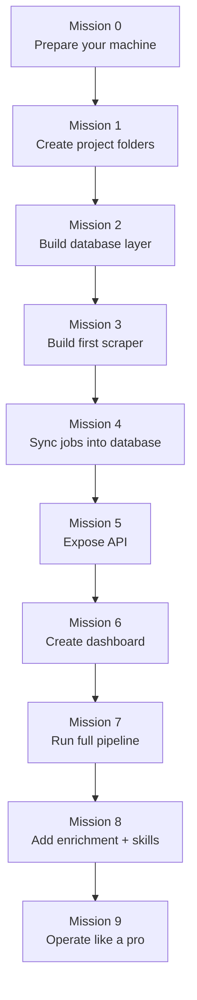
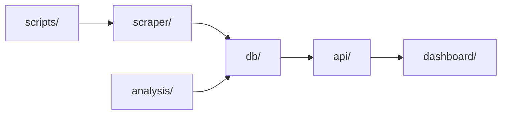
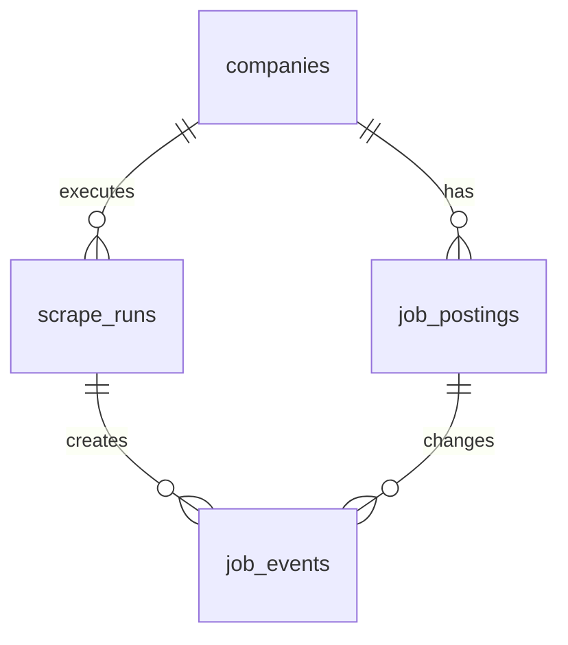
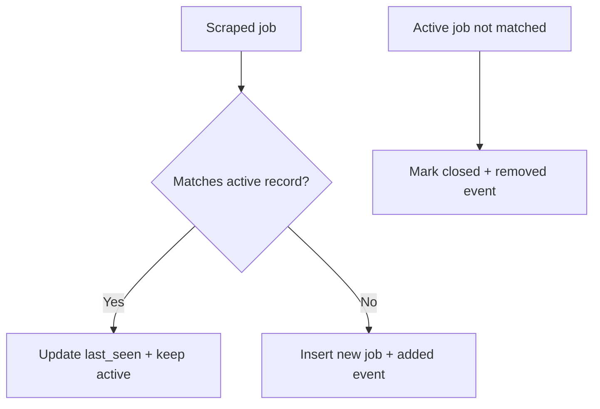
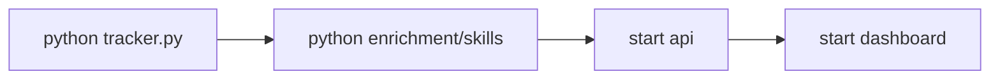
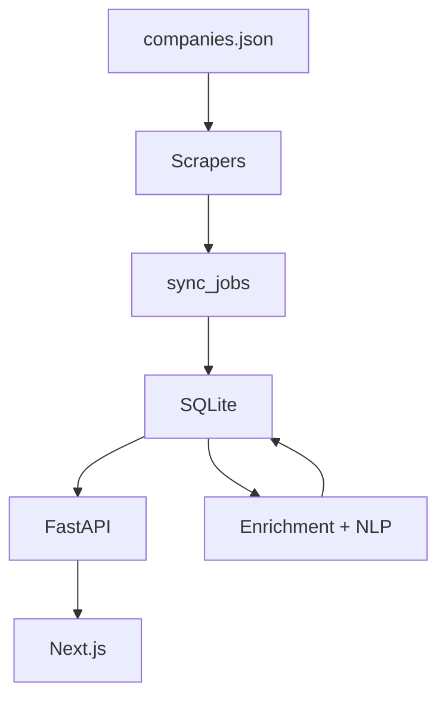
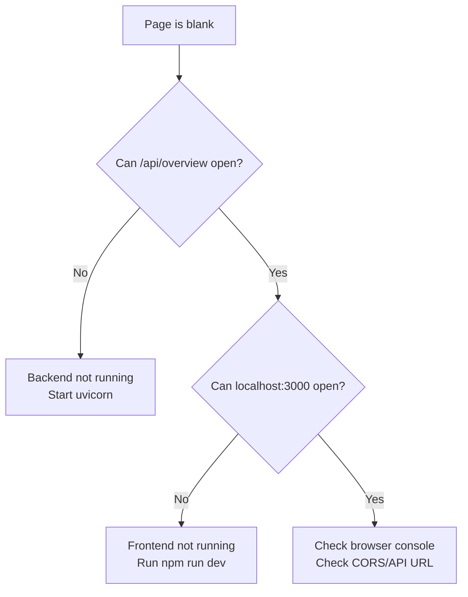

# Startup Tracker Tutorial Workbook

Audience: beginner to low-technical background  
Goal: rebuild a working version by hand, while learning why each part exists

---

## How to use this workbook

This workbook is designed as a mission path.

- Read one mission at a time.
- Copy code exactly.
- Run the checkpoint command before moving on.
- If a checkpoint fails, use the "If stuck" box in that mission.

Learning rhythm:

1. Build a small piece.
2. See it working.
3. Understand it visually.
4. Continue.

---

## Mission Map



Progress board:

- [ ] Mission 0 complete
- [ ] Mission 1 complete
- [ ] Mission 2 complete
- [ ] Mission 3 complete
- [ ] Mission 4 complete
- [ ] Mission 5 complete
- [ ] Mission 6 complete
- [ ] Mission 7 complete
- [ ] Mission 8 complete
- [ ] Mission 9 complete

---

## Mission 0: Prepare your machine

### Goal
Install and verify required tools.

### Run

```bash
python3 --version
node --version
npm --version
```

### Expected
You should see version numbers, not "command not found".

### If stuck

- Install Python from [python.org](https://www.python.org/downloads/)
- Install Node LTS from [nodejs.org](https://nodejs.org/)
- Restart terminal and run checks again

---

## Mission 1: Create your project workspace

### Goal
Create the same layer structure used by the real app.

### Run

```bash
cd ~/Desktop
mkdir startup-tracker-learning
cd startup-tracker-learning
mkdir -p api db scraper analysis dashboard/src/app dashboard/src/lib scripts data
```

### Visual



### Check

```bash
find . -maxdepth 2 -type d | sort
```

---

## Mission 2: Build the database foundation

### Goal
Create a SQLite database with core tables.

Create file: `db/models.py`

```python
# Import sqlite so we can talk to a local database file.
import sqlite3

# Import Path so file paths work consistently on any OS.
from pathlib import Path

# Define where the DB file will live.
DB_PATH = Path("data/tracker.db")


def get_connection():
    # Ensure the parent folder exists before opening DB.
    DB_PATH.parent.mkdir(parents=True, exist_ok=True)

    # Open a SQLite connection to our DB file.
    conn = sqlite3.connect(DB_PATH)

    # Make rows behave like dictionaries (row["column_name"]).
    conn.row_factory = sqlite3.Row

    # Enable WAL mode for better read/write concurrency.
    conn.execute("PRAGMA journal_mode=WAL")

    # Enforce foreign key constraints.
    conn.execute("PRAGMA foreign_keys=ON")

    # Return the ready-to-use DB connection.
    return conn


def init_db():
    # Open connection.
    conn = get_connection()

    # Use transaction block for schema creation.
    with conn:
        # Create core tables if they do not exist.
        conn.executescript(
            """
            CREATE TABLE IF NOT EXISTS companies (
                id INTEGER PRIMARY KEY AUTOINCREMENT,
                name TEXT NOT NULL UNIQUE,
                ats_type TEXT NOT NULL,
                ats_identifier TEXT,
                sector TEXT,
                company_type TEXT DEFAULT 'startup'
            );

            CREATE TABLE IF NOT EXISTS job_postings (
                id INTEGER PRIMARY KEY AUTOINCREMENT,
                company_id INTEGER NOT NULL REFERENCES companies(id),
                title TEXT NOT NULL,
                location TEXT,
                department TEXT,
                url TEXT,
                external_id TEXT,
                first_seen_at DATETIME DEFAULT (datetime('now')),
                last_seen_at DATETIME DEFAULT (datetime('now')),
                posting_status TEXT DEFAULT 'active',
                is_active BOOLEAN DEFAULT 1
            );

            CREATE TABLE IF NOT EXISTS scrape_runs (
                id INTEGER PRIMARY KEY AUTOINCREMENT,
                company_id INTEGER NOT NULL REFERENCES companies(id),
                run_at DATETIME DEFAULT (datetime('now')),
                jobs_found INTEGER DEFAULT 0,
                jobs_added INTEGER DEFAULT 0,
                jobs_removed INTEGER DEFAULT 0,
                status TEXT DEFAULT 'success'
            );

            CREATE TABLE IF NOT EXISTS job_events (
                id INTEGER PRIMARY KEY AUTOINCREMENT,
                job_id INTEGER NOT NULL REFERENCES job_postings(id),
                run_id INTEGER NOT NULL REFERENCES scrape_runs(id),
                event_type TEXT NOT NULL,
                created_at DATETIME DEFAULT (datetime('now'))
            );
            """
        )

    # Close connection.
    conn.close()
```

### Check

```bash
python3 - <<'PY'
from db.models import init_db
init_db()
print('DB created')
PY
```

### Visual: table relationships



---

## Mission 3: Build your first scraper

### Goal
Collect jobs from Greenhouse and normalize fields.

Create file: `scraper/base.py`

```python
# Import dataclass to define clean structured data objects.
from dataclasses import dataclass

# Import Optional for fields that may be empty.
from typing import Optional


@dataclass
class JobPosting:
    # Required fields.
    title: str
    company: str

    # Optional fields from ATS providers.
    external_id: Optional[str] = None
    location: Optional[str] = None
    department: Optional[str] = None
    url: Optional[str] = None

    def to_dict(self):
        # Convert dataclass to plain dict for DB writing.
        return {
            "title": self.title,
            "company": self.company,
            "external_id": self.external_id,
            "location": self.location,
            "department": self.department,
            "url": self.url,
        }
```

Create file: `scraper/greenhouse.py`

```python
# aiohttp lets us call APIs asynchronously.
import aiohttp

# Import the shared normalized job model.
from scraper.base import JobPosting


async def parse(company_name: str, slug: str):
    # Build Greenhouse API URL for this company slug.
    url = f"https://boards-api.greenhouse.io/v1/boards/{slug}/jobs?content=true"

    # Open network session.
    async with aiohttp.ClientSession() as session:
        # Call API with timeout.
        async with session.get(url, timeout=aiohttp.ClientTimeout(total=15)) as resp:
            # If not successful, return empty list.
            if resp.status != 200:
                return []

            # Parse JSON body.
            data = await resp.json()

    # Build normalized job list.
    jobs = []

    # Iterate each job in API response.
    for row in data.get("jobs") or []:
        jobs.append(
            JobPosting(
                # Job title.
                title=row.get("title", ""),
                # Company display name.
                company=company_name,
                # Stable ATS job ID.
                external_id=str(row.get("id")) if row.get("id") else None,
                # Human readable location.
                location=(row.get("location") or {}).get("name"),
                # First department if present.
                department=((row.get("departments") or [{}])[0]).get("name"),
                # Public application URL.
                url=row.get("absolute_url"),
            )
        )

    # Return only jobs that have a title.
    return [j for j in jobs if j.title]
```

### Check

```bash
python3 - <<'PY'
import asyncio
from scraper.greenhouse import parse

async def main():
    rows = await parse('Stripe', 'stripe')
    print('jobs fetched:', len(rows))
    if rows:
        print('example title:', rows[0].title)

asyncio.run(main())
PY
```

---

## Mission 4: Sync jobs into database

### Goal
Insert new jobs, keep existing jobs updated, close missing jobs.

Create file: `db/queries.py`

```python
# Import DB connection factory.
from db.models import get_connection


def upsert_company(company: dict) -> int:
    # Open DB connection.
    conn = get_connection()

    # Run write transaction.
    with conn:
        # Insert company, or update key metadata on name conflict.
        conn.execute(
            """
            INSERT INTO companies(name, ats_type, ats_identifier, sector, company_type)
            VALUES (?, ?, ?, ?, ?)
            ON CONFLICT(name) DO UPDATE SET
                ats_type=excluded.ats_type,
                ats_identifier=excluded.ats_identifier,
                sector=excluded.sector,
                company_type=excluded.company_type
            """,
            (
                company["name"],
                company["ats_type"],
                company.get("ats_identifier"),
                company.get("sector"),
                company.get("company_type", "startup"),
            ),
        )

        # Read final company id.
        row = conn.execute(
            "SELECT id FROM companies WHERE name = ?",
            (company["name"],),
        ).fetchone()

    # Close connection.
    conn.close()

    # Return id as integer.
    return row["id"]


def log_run(company_id: int, jobs_found: int, jobs_added: int, jobs_removed: int, status: str = "success") -> int:
    # Open DB connection.
    conn = get_connection()

    # Insert scrape run row.
    with conn:
        cur = conn.execute(
            """
            INSERT INTO scrape_runs(company_id, jobs_found, jobs_added, jobs_removed, status)
            VALUES (?, ?, ?, ?, ?)
            """,
            (company_id, jobs_found, jobs_added, jobs_removed, status),
        )

        # Capture run id for linking events.
        run_id = cur.lastrowid

    # Close connection.
    conn.close()

    # Return run id.
    return run_id


def sync_jobs(company_id: int, run_id: int, scraped_jobs: list[dict]):
    # Open DB connection.
    conn = get_connection()

    # Pull currently active jobs for this company.
    existing = conn.execute(
        """
        SELECT id, external_id, title
        FROM job_postings
        WHERE company_id = ? AND is_active = 1
        """,
        (company_id,),
    ).fetchall()

    # Build quick lookup maps.
    by_external_id = {r["external_id"]: r["id"] for r in existing if r["external_id"]}
    by_title = {r["title"].strip().lower(): r["id"] for r in existing if r["title"]}

    # Keep track of records we matched this run.
    matched_ids = set()

    # Count newly added jobs.
    added = 0

    with conn:
        # Process every scraped job.
        for job in scraped_jobs:
            existing_id = None

            # Try best match by external id.
            ext_id = job.get("external_id")
            if ext_id and ext_id in by_external_id:
                existing_id = by_external_id[ext_id]

            # Fallback match by normalized title.
            if not existing_id:
                title_key = job.get("title", "").strip().lower()
                if title_key in by_title:
                    existing_id = by_title[title_key]

            if existing_id:
                # Mark as seen and keep active.
                matched_ids.add(existing_id)
                conn.execute(
                    """
                    UPDATE job_postings
                    SET last_seen_at = datetime('now'), posting_status='active', is_active=1
                    WHERE id = ?
                    """,
                    (existing_id,),
                )
            else:
                # Insert brand new job.
                cur = conn.execute(
                    """
                    INSERT INTO job_postings(
                        company_id, title, location, department, url, external_id,
                        posting_status, is_active
                    )
                    VALUES (?, ?, ?, ?, ?, ?, 'active', 1)
                    """,
                    (
                        company_id,
                        job.get("title"),
                        job.get("location"),
                        job.get("department"),
                        job.get("url"),
                        job.get("external_id"),
                    ),
                )

                # New inserted id.
                new_job_id = cur.lastrowid

                # Log add event.
                conn.execute(
                    "INSERT INTO job_events(job_id, run_id, event_type) VALUES (?, ?, 'added')",
                    (new_job_id, run_id),
                )

                # Increase add counter.
                added += 1

        # Detect jobs that disappeared this run.
        removed = 0
        for row in existing:
            if row["id"] not in matched_ids:
                # Mark missing jobs as closed.
                conn.execute(
                    """
                    UPDATE job_postings
                    SET is_active = 0, posting_status='closed'
                    WHERE id = ?
                    """,
                    (row["id"],),
                )

                # Log remove event.
                conn.execute(
                    "INSERT INTO job_events(job_id, run_id, event_type) VALUES (?, ?, 'removed')",
                    (row["id"], run_id),
                )

                # Increase remove counter.
                removed += 1

        # Update run metrics with final counts.
        conn.execute(
            "UPDATE scrape_runs SET jobs_added=?, jobs_removed=? WHERE id=?",
            (added, removed, run_id),
        )

    # Close connection.
    conn.close()

    # Return summary tuple.
    return added, removed


def get_overview_stats(company_type=None):
    # Open connection.
    conn = get_connection()

    # Count companies (optionally scoped by type).
    if company_type:
        total_companies = conn.execute(
            "SELECT COUNT(*) FROM companies WHERE company_type = ?",
            (company_type,),
        ).fetchone()[0]
    else:
        total_companies = conn.execute("SELECT COUNT(*) FROM companies").fetchone()[0]

    # Count active jobs (optionally scoped by company type).
    if company_type:
        total_active_jobs = conn.execute(
            """
            SELECT COUNT(*)
            FROM job_postings jp
            JOIN companies c ON c.id = jp.company_id
            WHERE jp.is_active = 1 AND c.company_type = ?
            """,
            (company_type,),
        ).fetchone()[0]
    else:
        total_active_jobs = conn.execute(
            "SELECT COUNT(*) FROM job_postings WHERE is_active = 1"
        ).fetchone()[0]

    # Last successful run timestamp.
    last_run = conn.execute("SELECT MAX(run_at) FROM scrape_runs").fetchone()[0]

    # Close connection.
    conn.close()

    # Return dashboard-friendly shape.
    return {
        "total_companies": total_companies,
        "total_active_jobs": total_active_jobs,
        "last_run": last_run,
        "net_added": 0,
        "net_removed": 0,
    }
```

### Visual: sync logic



---

## Mission 5: Build the orchestrator

### Goal
Run one command to scrape and sync all tracked companies.

Create file: `companies.json`

```json
[
  {
    "name": "Stripe",
    "ats_type": "greenhouse",
    "ats_identifier": "stripe",
    "sector": "Fintech & Payments",
    "company_type": "bigco"
  },
  {
    "name": "Notion",
    "ats_type": "greenhouse",
    "ats_identifier": "notion",
    "sector": "Enterprise Software",
    "company_type": "startup"
  }
]
```

Create file: `tracker.py`

```python
# asyncio is used to run async scraper functions.
import asyncio

# json loads the companies config file.
import json

# Path gives stable file handling.
from pathlib import Path

# Initialize database schema.
from db.models import init_db

# Query helpers for company upsert + job sync.
from db import queries

# Greenhouse scraper module.
import scraper.greenhouse as greenhouse_scraper

# Companies source file path.
COMPANIES_FILE = Path("companies.json")


def load_companies() -> list:
    # Open and parse JSON config.
    with open(COMPANIES_FILE) as f:
        return json.load(f)


async def scrape_company(company: dict, company_id: int):
    # Read key company fields.
    name = company["name"]
    ats_type = company["ats_type"]

    # Support Greenhouse in this tutorial build.
    if ats_type == "greenhouse":
        jobs = await greenhouse_scraper.parse(name, company["ats_identifier"])
    else:
        # Unknown ATS in this tutorial path.
        jobs = []

    # Convert JobPosting objects to dictionaries.
    job_dicts = [j.to_dict() for j in jobs]

    # Create run row with placeholder add/remove counts.
    run_id = queries.log_run(company_id, len(jobs), 0, 0, status="success")

    # Sync canonical job state.
    added, removed = queries.sync_jobs(company_id, run_id, job_dicts)

    # Return summary.
    return len(jobs), added, removed


async def run():
    # Ensure DB schema exists.
    init_db()

    # Load company list.
    companies = load_companies()

    # Map company names to DB ids.
    company_ids = {}
    for c in companies:
        company_ids[c["name"]] = queries.upsert_company(c)

    # Process all companies one-by-one for beginner clarity.
    for c in companies:
        found, added, removed = await scrape_company(c, company_ids[c["name"]])
        print(f"{c['name']}: found={found} added={added} removed={removed}")


if __name__ == "__main__":
    # Entry point.
    asyncio.run(run())
```

### Check

```bash
python3 tracker.py
```

---

## Mission 6: Build API layer

### Goal
Expose data to frontend.

Create file: `api/app.py`

```python
# FastAPI framework.
from fastapi import FastAPI

# Optional type for query params.
from typing import Optional

# Ensure database exists at API startup.
from db.models import init_db

# Query layer for reading stats.
from db import queries

# Create web app instance.
app = FastAPI(title="Startup Tracker API")

# Initialize DB schema now.
init_db()


@app.get("/api/overview")
def overview(company_type: Optional[str] = None):
    # Return high-level totals for dashboard cards.
    return queries.get_overview_stats(company_type=company_type)
```

### Check

```bash
uvicorn api.app:app --reload --port 8000
```

Open [http://localhost:8000/api/overview](http://localhost:8000/api/overview)

---

## Mission 7: Build dashboard layer

### Goal
Show API data in a browser page.

Inside `dashboard/` run:

```bash
npm init -y
npm install next react react-dom
npm install -D typescript @types/react @types/react-dom @types/node
```

Create file: `dashboard/package.json` (replace scripts section):

```json
{
  "name": "dashboard",
  "private": true,
  "scripts": {
    "dev": "next dev",
    "build": "next build",
    "start": "next start"
  }
}
```

Create file: `dashboard/src/app/page.tsx`

```tsx
"use client";

// React hooks for state and lifecycle.
import { useEffect, useState } from "react";

export default function Page() {
  // Hold API response.
  const [data, setData] = useState<any>(null);

  // Fetch once after component mounts.
  useEffect(() => {
    fetch("http://localhost:8000/api/overview")
      .then((r) => r.json())
      .then(setData)
      .catch(() => setData({ error: true }));
  }, []);

  return (
    <main style={{ padding: 24, fontFamily: "sans-serif", maxWidth: 900, margin: "0 auto" }}>
      <h1>Startup Tracker</h1>
      <p style={{ color: "#555" }}>Tutorial dashboard</p>

      {!data ? (
        <p>Loading...</p>
      ) : data.error ? (
        <p>Could not load API data.</p>
      ) : (
        <section style={{ border: "1px solid #ddd", borderRadius: 8, padding: 16 }}>
          <p>Total companies: {data.total_companies}</p>
          <p>Total active jobs: {data.total_active_jobs}</p>
          <p>Last run: {data.last_run || "Never"}</p>
        </section>
      )}
    </main>
  );
}
```

### Check

```bash
cd dashboard
npm run dev
```

Open [http://localhost:3000](http://localhost:3000)

---

## Mission 8: Add simple enrichment + skill extraction

### Goal
Turn raw text into useful analytics dimensions.

Create file: `scraper/enrichment.py`

```python
# Import DB connection.
from db.models import get_connection


def enrich_all():
    # Open connection.
    conn = get_connection()

    # Get jobs missing basic normalized fields.
    rows = conn.execute(
        """
        SELECT id, title, location, department
        FROM job_postings
        WHERE posting_status IS NULL OR department IS NULL
        """
    ).fetchall()

    if not rows:
        conn.close()
        return 0

    with conn:
        for r in rows:
            # Fallback department if missing.
            department = r["department"] or "Other"

            # Ensure status default.
            status = "active"

            # Update row.
            conn.execute(
                """
                UPDATE job_postings
                SET department = ?, posting_status = ?
                WHERE id = ?
                """,
                (department, status, r["id"]),
            )

    count = len(rows)
    conn.close()
    return count
```

Create file: `analysis/nlp.py`

```python
# Regex engine.
import re

# DB connection.
from db.models import get_connection

# Tiny starter dictionary.
SKILLS = {
    "Python": re.compile(r"\\bPython\\b", re.I),
    "SQL": re.compile(r"\\bSQL\\b", re.I),
    "React": re.compile(r"\\bReact\\b", re.I),
}


def extract_skills(text: str):
    # Return matched canonical skill names.
    if not text:
        return []
    found = []
    for name, pattern in SKILLS.items():
        if pattern.search(text):
            found.append(name)
    return found


def extract_all_skills():
    # Open connection.
    conn = get_connection()

    # Ensure table exists.
    with conn:
        conn.execute(
            """
            CREATE TABLE IF NOT EXISTS job_skills (
                job_id INTEGER NOT NULL REFERENCES job_postings(id),
                skill TEXT NOT NULL,
                PRIMARY KEY(job_id, skill)
            )
            """
        )

    # Read jobs.
    rows = conn.execute("SELECT id, title FROM job_postings").fetchall()

    total = 0
    with conn:
        for r in rows:
            # Use title as text source in this mini tutorial.
            skills = extract_skills(r["title"])
            for s in skills:
                conn.execute(
                    "INSERT OR IGNORE INTO job_skills(job_id, skill) VALUES (?, ?)",
                    (r["id"], s),
                )
                total += 1

    conn.close()
    return total
```

---

## Mission 9: Run and operate

### Goal
Run the complete mini pipeline in the correct order.

### Run order



### Commands

Terminal 1:

```bash
cd ~/Desktop/startup-tracker-learning
source .venv/bin/activate
python3 tracker.py
python3 - <<'PY'
from scraper.enrichment import enrich_all
from analysis.nlp import extract_all_skills
print('enriched:', enrich_all())
print('skills:', extract_all_skills())
PY
uvicorn api.app:app --reload --port 8000
```

Terminal 2:

```bash
cd ~/Desktop/startup-tracker-learning/dashboard
npm run dev
```

---

## Quick visual recap



---

## Beginner troubleshooting tree



---

## What to learn next

1. Add more scrapers (`ashby`, `lever`, `smartrecruiters`).
2. Add richer lifecycle logic (`suspected_closed` before hard close).
3. Add job events analytics endpoint and changes chart.
4. Add resume-fit endpoint and upload UI.

---

## Appendix A: How this tutorial maps to the real repo

| Tutorial Component | Real Project Component |
|---|---|
| minimal `db/models.py` | full schema + migration-safe alters |
| one scraper | many ATS modules in `scraper/` |
| simple `sync_jobs` | robust identity + lifecycle + event logic |
| one overview endpoint | full API surface in `api/app.py` |
| one dashboard page | many pages in `dashboard/src/app/*` |

